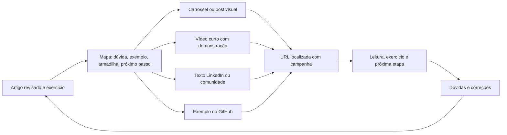

# Estratégia de SEO, distribuição e crescimento

Data: 8 de setembro de 2026. Recomendações para este repositório e sua visão educacional. Não foram criadas campanhas, contas de analytics, posts ou configurações externas nesta etapa. Não há promessa de posição no Google nem estimativa de CPC de mercado.

Documentos relacionados: [auditoria frontend](FRONTEND_ANALYSIS.md), [arquitetura backend](BACKEND_ARCHITECTURE.md) e [roadmap](ROADMAP.md).

## 1. Posicionamento e critério de sucesso

Proposta: ensinar os fundamentos por trás das ferramentas de programação, com exemplos reproduzíveis, linguagem acessível, trilhas e código aberto. O acervo atual combina JavaScript/TypeScript, TSConfig, fundamentos de Node.js e arquitetura backend. Esses quatro temas permitem iniciar duas trilhas coerentes, sem abrir dez editorias vazias.

Público inicial sugerido: pessoas que já encontram React/Node/TypeScript no estudo ou trabalho, mas querem entender por que as coisas funcionam. Iniciantes devem encontrar pré-requisitos e explicações; leitores experientes devem encontrar limites, fontes e tradeoffs. Evitar comunicar o blog apenas como conteúdo para “arquitetos de software”, como faz hoje o footer.

Objetivo educacional: leitores conseguem explicar um conceito e executar um exercício. Objetivo comunitário: perguntas, correções e contribuições úteis. Objetivo de portfólio: demonstrar decisões, testes e operação reais, com contato profissional disponível sem interferir na leitura.

Views, likes, seguidores e estrelas são sinais auxiliares. Não equivalem a aprendizagem, confiança ou contratos. O melhor indicador inicial combina visitas qualificadas com ações de continuidade e evidências qualitativas de que alguém conseguiu usar o conteúdo.

## 2. Ponto de partida observado

| Existe | Lacuna para descoberta |
| --- | --- |
| Quatro artigos, oito arquivos Markdown PT/EN | Idiomas não possuem URLs funcionais próprias |
| Layout editorial, catálogo, séries e tags | Slugs de arquitetura quebram links; séries não têm ordem correta |
| Código e exemplos nos textos | Renderer descarta headings e leituras relacionadas, não renderiza tabelas GFM |
| React/Vite com build válido | `dist/index.html` contém apenas shell; title/description genéricos |
| Busca local e seletor de idioma | Busca fixa em PT e seletor sem navegar para tradução |
| Footer e CTA GitHub | Links institucionais fictícios e GitHub genérico |
| Espaço visual de newsletter | Inscrição apenas simulada; não pode ser usada como conversão |

Prioridade de aquisição antes de divulgar: garantir que a pessoa chega à URL certa, lê o conteúdo completo no celular e encontra o próximo passo. Comprar tráfego antes dessas correções compraria visitas para fluxos quebrados.

## 3. SEO técnico: contrato entre frontend, backend e hospedagem

SEO não exige criar um “serviço de SEO”. O backend fornece dados editoriais corretos; o frontend os transforma em HTML; a hospedagem entrega status, cache, redirects e arquivos públicos adequados.

| Item | Frontend/renderização | Backend/publicação | Hospedagem/validação |
| --- | --- | --- | --- |
| Texto indexável | Artigo completo no HTML inicial | Snapshot de traduções publicadas | Abrir URL sem executar JS e encontrar conteúdo |
| URL/slug | Links localizados gerados por função única | ID estável, slug por locale e aliases quando necessários | 301/308 de URL antiga; 404 para inexistente |
| Title/description | Metadata específica no head | Campos editoriais/overrides validados | Inspecionar HTML de cada tradução |
| Canonical | Uma URL absoluta limpa por página | Domínio/rota autorizados | Sem apontar todos os artigos à home ou EN a PT |
| Hreflang | Alternates recíprocos | Relação entre traduções publicadas | Validar destinos 200 e correspondência de artigo |
| OG/Twitter Cards | Head inicial e imagem da tradução | Texto, imagem e alt públicos | Preview real sem login e assets acessíveis |
| Sitemap | Artefato gerado junto da publicação | Lista completa de URLs e updatedAt editorial | `/sitemap.xml`, Search Console e smoke |
| Robots | Meta robots por tipo de página | Não expor drafts na API pública | `/robots.txt`; remover noindex de produção correta |
| JSON-LD | BlogPosting e BreadcrumbList visíveis/coerentes | Autor, datas, título, imagem, URL | Rich Results Test e inspeção do HTML |
| Performance | CSS/JS enxutos, imagens dimensionadas | Listagens sem body, consultas limitadas | CDN, compressão, cache e métricas de campo |
| Segurança de conteúdo | Markdown seguro, JSON-LD serializado | Validação/sanitização na fronteira | CSP do site, HTTPS e acesso privado a previews |

### CSR, SSG e SSR para este blog

O build atual é CSR. Google pode renderizar JavaScript, mas conteúdo pronto reduz dependência dessa etapa e atende crawlers sem execução de JS. Para artigos que mudam por publicação, geração estática é uma escolha proporcional. Comentários e curtidas futuros podem ser carregados separadamente no cliente. [Google: JavaScript SEO](https://developers.google.com/search/docs/crawling-indexing/javascript/javascript-seo-basics).

A preferência inicial é preservar React/layout e testar pré-renderização com solução mantida sobre Vite. Next.js é alternativa se suas convenções reduzirem o esforço total. Não migrar por suposto bônus de ranking do nome do framework. Decisão, prova técnica e custos estão na [auditoria](FRONTEND_ANALYSIS.md#10-react-spa-ssg-ssr-e-nextjs).

Critérios de aceite independentemente da ferramenta:

- GET direto de artigo publicado retorna 200 com título, conteúdo, idioma e metadata corretos no HTML.
- URL inexistente retorna 404; artigo removido permanentemente pode retornar 410 conforme política. Não devolver home com 200.
- Links internos funcionam sem sequência prévia de cliques; fragmentos são só âncoras dentro do texto, não roteamento de páginas.
- Renderização não depende de estar autenticado, ter consentido analytics ou escolhido locale em localStorage.
- Atualização editorial regenera/revalida páginas e sitemap; build falho mantém artefato anterior e gera alerta.
- API indisponível não impede ler HTML já publicado; falha de comentários não apaga o artigo.

### Metadata e compartilhamento

Title precisa descrever a dúvida específica; description resume ganho e escopo sem prometer demais. Não existe necessidade de usar palavra-chave repetida em cada heading. Tamanhos editoriais devem priorizar clareza e preview; cortes em buscadores variam, portanto limites de caracteres não são garantias de exibição.

Exemplo **proposto, para futuro artigo**, não publicação existente:

| Campo | PT-BR | EN |
| --- | --- | --- |
| Title | Event Loop no Node.js: entenda a ordem de execução | Node.js Event Loop: Understand Execution Order |
| Description | Acompanhe um exemplo com código síncrono, Promises e timers e teste o que muda no ambiente de execução. | Follow synchronous code, Promises, and timers, then test how the execution environment affects the result. |
| Slug | `event-loop-nodejs` | `nodejs-event-loop` |
| URL | `/pt-BR/articles/event-loop-nodejs` | `/en/articles/nodejs-event-loop` |

Open Graph: `og:type=article`, title, description, URL e imagem absolutos, dimensões, alt e locale. Twitter Cards: `summary_large_image`, title/description/image coerentes. Imagem social pode ser template tipográfico simples; não precisa IA nem um serviço de geração dinâmica. Manter dimensões e proporção adequadas ao canal e testar preview real. Não incluir emails, IDs de sessão ou informações privadas nas URLs.

Não manter `meta keywords` como tarefa de otimização: Google não a usa para indexação/ranking. `robots` tem funções específicas e não deve ser preenchido por ritual. [Google: metatags suportadas](https://developers.google.com/search/docs/crawling-indexing/special-tags).

### Canonical, parâmetros e indexação

Política proposta de URL limpa: locale explícito, HTTPS, host único e uma convenção de barra final. Canonical do artigo exclui UTM, parâmetros de campanha e contexto de série. A página 2 de um arquivo real contém itens diferentes: não apontar sua canonical automaticamente para página 1.

Resultados de busca interna e combinações arbitrárias de filtros não são páginas editoriais para indexar. Podem receber `noindex` quando publicados, enquanto páginas de tags/séries têm URL estável e introdução útil. Não lançar centenas de tags vazias ou combinações automaticamente. Remover placeholders do sitemap e da navegação pública.

`robots.txt` controla crawling, não protege dados. Se o objetivo é que um robô leia `noindex`, bloquear essa página em robots pode impedir que ele veja a diretiva. Drafts/previews/admin precisam de controle de acesso. Arquivos JS/CSS essenciais não devem ser bloqueados sem motivo.

### Sitemap e RSS

Gerar sitemap a partir do catálogo publicado completo, usando URLs absolutas e `lastmod` de revisão relevante. Não usar data do último deploy ou da última curtida. Enviar no Search Console; isso facilita descoberta, mas não garante indexação. Poucos artigos cabem em um arquivo. Sitemap index separado por locale só quando facilitar operação. [Google: sitemaps](https://developers.google.com/search/docs/crawling-indexing/sitemaps/build-sitemap).

RSS/Atom é um bom complemento de baixo custo após a base de lançamento: conteúdo público por idioma, sem pedir conta/email. Não é pré-requisito para o MVP nem substitui sitemap. Newsletter é outra operação, com opt-in e descadastro; não ativar somente porque já há um formulário no layout.

### Dados estruturados

Usar `BlogPosting`, subtipo de Article, com headline, description, datePublished, dateModified, inLanguage, author público, image quando real, URL e mainEntityOfPage. A data precisa corresponder à tradução exibida; não simular atualização para parecer recente. JSON-LD não cria garantia de rich result. [Google: Article](https://developers.google.com/search/docs/appearance/structured-data/article).

`BreadcrumbList` representa caminho de navegação visível: início → artigos → artigo, ou início → séries → série. Um artigo em várias trilhas continua com canonical única. Não inventar níveis de categoria só para completar schema. [Google: BreadcrumbList](https://developers.google.com/search/docs/appearance/structured-data/breadcrumb).

Não usar estrelas de `AggregateRating` para transformar likes em avaliação nem declarar Review/FAQ com finalidade de obter exibição indevida. Dados estruturados descrevem o conteúdo real. Serializar JSON com proteção contra encerramento de script (`</script>`) quando incorporar valores editoriais ao HTML.

### Performance e Core Web Vitals

Baseline local: o build entregou JS principal de 421,08 kB, gzip 132,89 kB. Todos os corpos PT/EN entram por imports raw no grafo do cliente. Isso é um ponto concreto para melhorar, não prova de LCP ruim. Separar corpo do bundle inicial e gerar HTML tem maior prioridade que memoização espalhada.

Metas de referência de campo: LCP até 2,5 s, INP até 200 ms e CLS até 0,1 no percentil 75, separando móvel/desktop. Laboratório ajuda diagnóstico; sem tráfego, não há amostra real suficiente para afirmar aprovação em campo. [web.dev: Web Vitals](https://web.dev/articles/vitals).

Plano prático:

1. Imagens próprias/licenciadas com dimensões, compressão, formatos e `srcset` adequados. Não lazy-load da imagem principal que for LCP; lazy-load abaixo da dobra.
2. Preservar fontes de sistema ou hospedar poucas fontes se houver ganho de identidade; não adicionar terceiros só para estética.
3. Lazy-load da busca/modal e interações quando fizer sentido; syntax highlighting preferencialmente no build ou carregado sob demanda.
4. Reservar espaço para contadores/comentários e imagem para evitar saltos. Texto deve estar disponível antes desses widgets.
5. Cache longo para assets com hash; HTML revalidável; Brotli/gzip no host. Não cachear sessão ou token CSRF em CDN.
6. Lighthouse/PageSpeed no início e após mudanças relevantes; métricas de campo quando houver volume. Não tratar nota 100 como condição para publicar.

## 4. SEO internacional

Separar idiomas na URL é necessário para este desenho: `/{locale}/articles/{slug}`. A página deve ter idioma predominante coerente no conteúdo e na navegação. Não publicar só o menu traduzido com corpo em outro idioma. Links visíveis permitem mudar para uma tradução existente sem redirecionar à força uma URL explícita. [Google: sites multilíngues](https://developers.google.com/search/docs/specialty/international/managing-multi-regional-sites).

Backend mantém o vínculo estável entre traduções; frontend usa esse vínculo para gerar alternates. `hreflang` identifica idioma/região, não posição no Google. Canonical resolve a versão preferida de uma URL, não substitui alternates. Exemplos de conjunto para o artigo futuro, com domínio ilustrativo:

```html
<!-- Head da versão PT-BR: exemplo, não configuração já instalada -->
<link rel="canonical" href="https://example.com/pt-BR/articles/event-loop-nodejs">
<link rel="alternate" hreflang="pt-BR" href="https://example.com/pt-BR/articles/event-loop-nodejs">
<link rel="alternate" hreflang="en" href="https://example.com/en/articles/nodejs-event-loop">
```

Na versão EN, canonical muda para EN; o conjunto de alternates permanece recíproco. Omitir `x-default` enquanto não houver destino neutro deliberado. Fonte técnica: [Google: hreflang](https://developers.google.com/search/docs/specialty/international/localized-versions).

Tradução ausente não entra no sitemap/alternates; interface mostra opções existentes. Correção relevante no original deve abrir tarefa de revisão da tradução; tradução automática sem revisão não é critério de expansão. As duas versões têm datas editoriais próprias e podem ser publicadas em momentos diferentes.

No início, PT-BR é canal principal de distribuição e EN recebe versão revisada para descoberta internacional. Isso evita duplicar imediatamente a carga de redes sociais. Medir procura em cada idioma antes de abrir outro. Uma proposta de tradução da comunidade deve preservar articleId, ter revisor com domínio do idioma, adaptar exemplos quando necessário e registrar crédito.

## 5. SEO de conteúdo e desenho das trilhas

Planejar por dúvida real e resultado verificável, não por densidade de palavra-chave. Cada artigo deve ter uma questão principal e uma URL canônica; conteúdos relacionados aprofundam subproblemas em vez de repetir introduções. Fontes, autoria e exemplos próprios sustentam confiança. A orientação oficial privilegia conteúdo útil e com propósito para pessoas. [Google: conteúdo útil](https://developers.google.com/search/docs/fundamentals/creating-helpful-content).

### Acervo atual como ponto de partida

| Conteúdo existente | Função educacional | Melhorias antes de divulgar | Derivado inicial |
| --- | --- | --- | --- |
| JavaScript e TypeScript sem mistério | Entrada para fundamentos | Preservar headings e tabela; deixar pré-requisitos e próximos passos claros | Carrossel “o que TypeScript verifica e o que permanece em runtime” |
| TSConfig | Aplicação prática da configuração | Validar exemplos contra versão usada e acrescentar exercício curto | Vídeo comparando duas configurações e o erro que aparece |
| Node.js por baixo do framework | Explicar runtime antes do framework | Conectar o conceito a exemplo executável; indicar ambiente | Reel “o que acontece antes de uma rota Express responder?” |
| Arquitetura backend Base TS/Node | Evolução de organização do código | Corrigir slug; preservar seções; mostrar tradeoff e teste concreto | LinkedIn com decisão “por que não criar repository genérico” |

Os derivados acima são propostas editoriais. A correção técnica detalhada de cada texto precisa ser revisada antes da publicação; não basta a existência do arquivo.

Trilhas iniciais propostas:

- **Fundamentos JavaScript/TypeScript:** JS/TS → TSConfig → próximo artigo escolhido por dúvida real observada.
- **Base Node/backend:** Node por baixo do framework → arquitetura aplicada → futuras etapas de Event Loop, APIs, banco e observabilidade, ordenadas após revisão pedagógica.

Uma trilha não precisa esperar oito capítulos para existir. Publicar promessa honesta e quantidade real; remover contagem fictícia de “4 de 8” se os oito não estão definidos. Conteúdo avançado deve apontar pré-requisitos; conteúdo básico deve permitir avançar sem pressionar por cadastro.

### Modelo reutilizável de artigo

1. Dúvida central, público e conhecimento necessário.
2. Resposta curta que orienta o leitor antes do aprofundamento.
3. Exemplo mínimo com versão/ambiente e resultado esperado.
4. Explicação causal, limites e armadilhas; não só receita.
5. Exercício pequeno com critério de verificação, solução separada quando útil.
6. Próxima leitura e ligação à trilha.
7. Referências primárias, autoria, atualização real e link para sugerir correção.

Antes de escolher novos temas, usar dúvidas em comentários/issues/comunidades e consultas do Search Console. Quando pesquisar termos/SERP na implementação editorial, registrar intenção e lacunas, não copiar a estrutura de concorrentes. Evitar abrir uma ferramenta paga de palavras-chave antes de esgotar essa informação básica.

Linking interno: cada artigo aponta para pré-requisito e próximo passo; série aponta para seus membros; artigo referencia série. Tags só viram páginas indexáveis se reunirem conteúdo e explicação útil. Textos âncora devem dizer o que o destino ensina, não apenas “clique aqui”.

## 6. Google Search Console e diagnóstico

Configurar propriedade de domínio por DNS quando o domínio for escolhido; conceder acesso mínimo. Enviar sitemap, inspecionar uma URL de cada idioma e acompanhar erros/indexação. Search Console mostra descoberta em busca, incluindo impressões, cliques, CTR e posição média, com filtros por página/consulta/país/dispositivo. Esses dados não equivalem a sessões do analytics. [Relatório de desempenho](https://support.google.com/webmasters/answer/7576553).

Rotina semanal proposta de 20–30 minutos:

| Sinal | Hipótese a investigar | Ação |
| --- | --- | --- |
| URL importante não indexada | Falha de acesso, canonical, noindex, descoberta ou avaliação de conteúdo | Inspecionar URL/HTML/status/sitemap e ligações; não apenas reenviar sitemap |
| Impressões sobem, poucos cliques | Title não expressa intenção ou posição ainda baixa | Comparar consultas/posição; melhorar promessa sem clickbait |
| Cliques, pouca leitura qualificada | Introdução, mobile, exemplo ou velocidade não atendem promessa | Revisar landing page e ouvir leitores |
| Muito tráfego PT, quase nenhum EN | Demanda/distribuição diferentes ou problema técnico de alternates | Validar indexação EN antes de concluir que tradução não vale |
| Série recebe visitas, ninguém avança | Ordem/CTA/pré-requisitos pouco claros | Ver próximo passo e primeiro exercício |
| URL antiga continua recebendo acesso | Links externos e cache apontam versão anterior | Redirect permanente, atualizar links internos e manter compatibilidade |

Posição média varia por contexto; pequenas amostras oscilam. Não prometer indexação em sete dias nem sucesso em 90 dias. Search Console pode omitir consultas de baixo volume por privacidade; não tentar reconstruir identidade do visitante.

## 7. Analytics sem coleta excessiva

Separar três sistemas: métricas operacionais para estabilidade, métricas públicas de comunidade para visitas/likes/comentários e analytics para entender canais e leitura. Não construir um único rastreador que vincule todo clique à conta do GitHub.

### Ferramentas

| Opção | Responde bem | Custo/limite | Recomendação |
| --- | --- | --- | --- |
| Search Console | Como o conteúdo aparece na busca Google | Não mede todo tráfego nem leitura dentro do site | P0 |
| Métricas agregadas do host/CDN | Requests, transferência, erros | Bots e requests não são leitores; revisar logs/retention do fornecedor | P0 operacional, se disponível |
| Plausible | Páginas, origens e eventos com foco em minimização | Serviço pago ou operação própria conforme edição; revisar tratamento e contrato | Candidato para analytics simples após definir perguntas |
| Umami | Páginas/eventos e opção de controle operacional | Self-host também tem manutenção, atualização e backup | Alternativa se controle compensar operação |
| GA4 | Eventos, campanhas e integração com ecossistema Google | Configuração/consentimento mais cuidadosos e mais recursos que o MVP exige | Considerar ao amadurecer campanhas, não instalar por padrão |
| Analytics totalmente próprio | Controle de semântica | Coleta, retenção, bot filtering e painéis viram outro produto | Apenas contadores de domínio e eventos mínimos, sem plataforma própria |

As políticas do [Plausible](https://plausible.io/data-policy) e a [documentação do Umami](https://umami.is/docs/collect-data) ajudam a avaliar coleta; não são certificação de adequação automática à LGPD. Mesmo serviços sem cookies podem processar IP/transientes e operar em outro país. Preços e planos devem ser pesquisados na contratação; não há recomendação de compra imediata.

Default: lançar com Search Console e monitoramento operacional; adicionar **uma** solução simples de analytics quando for necessário comparar canais. Não instalar simultaneamente GA4, pixels Meta/TikTok e coletor próprio.

### Taxonomia de eventos proposta

Estes eventos não existem no código atual. Só implementar os que respondam a uma decisão, com payload allowlistado e controles de privacidade definidos.

| Evento | Quando | Campos mínimos | Uso |
| --- | --- | --- | --- |
| `article_open` | Abrir artigo publicado | articleId, locale, campaignCode opcional | Denominador por conteúdo/origem |
| `article_read_qualified` | Ex.: 60s de página visível e 50% de avanço, uma vez por navegação | articleId, locale | Proxy de atenção; não “aprendeu” |
| `article_end_reached` | Final do conteúdo visível | articleId, locale | Ver perdas no texto, com limitações de scroll |
| `series_start` | Abrir primeiro artigo a partir da série | seriesId, articleId, locale | Entrada deliberada na trilha |
| `series_next_click` | Clicar próximo passo no contexto da série | seriesId, fromArticleId, toArticleId | Continuidade; confirmar chegada quando possível sem identificar pessoa |
| `exercise_resource_click` | Abrir exemplo/exercício no GitHub | articleId, resourceKey | Interesse em praticar; clique não comprova execução |
| `like_added` / `comment_created` | Sucesso confirmado no backend | articleId/translationId, sem corpo/userId no analytics | Interação real; pode vir de agregação operacional |
| `newsletter_confirmed` | Double opt-in efetivamente concluído | campanha e locale, sem email no analytics | Só quando newsletter existir |
| `professional_contact_click` | Abrir canal de contato | canal, página de origem | Intenção de contato, não contrato fechado |

Parâmetros de leitura são hipóteses do projeto e devem poder mudar com versão da métrica. Diferem da view pública proposta no backend (10s + dedupe diário). Não comparar diretamente essas contagens. Evitar emitir eventos a cada pixel de scroll ou segundo; visibilidade/tempo podem ser computados no navegador e enviados em marcos discretos.

GA4 tem sua própria definição de sessão engajada, que não corresponde automaticamente à leitura qualificada acima. Documentar nomes e regras para não comparar métricas diferentes como se fossem iguais. [GA4: engagement rate](https://support.google.com/analytics/answer/12195621).

### Dados que não devem ir ao analytics

Email, nome de conta, ID GitHub, IP bruto, corpo de comentário, senha, tokens, URLs de reset/login e consultas livres potencialmente pessoais. Usar IDs editoriais, idioma e campanhas de vocabulário controlado. Referer completo pode trazer informação pessoal de outro site; guardar apenas domínio/categoria quando necessário. UTM nunca deve conter email ou nome do leitor.

Cohort de retorno em 7/30 dias exige distinguir visitas ao longo do tempo, o que pode aumentar coleta. Não prometer essa métrica com agregados sem identificador. Primeiro medir continuidade de sessão/trilha e feedback qualitativo. Retorno individual, se realmente necessário, precisa de escolha técnica/legal específica e transparência; não fingerprinting para contornar rejeição de cookies.

A seção de [privacidade do backend](BACKEND_ARCHITECTURE.md#16-privacidade-e-lgpd) define inventário, retenção, exclusão e validação jurídica. Consentimento, quando aplicável, precisa preceder tags; medição server-side não dispensa base legal ou transparência.

## 8. Sistema reutilizável de distribuição

Cada artigo deve gerar um pacote editorial pequeno. Não é obrigação publicar em todos os canais ao mesmo tempo. Começar com um canal de texto (LinkedIn/GitHub) e um de vídeo (Instagram **ou** TikTok), aprendendo formato antes de duplicar operação.



### Ficha de distribuição por artigo

Manter em Markdown ou planilha inicialmente: articleId, URL PT/EN, pergunta central, público, pré-requisitos, exemplo, promessa comprovável, três pontos de explicação, erro comum, exercício, CTA, formatos, data/canal, campanha, métricas e pergunta recebida. Isso é processo editorial, não tabela obrigatória no banco do blog.

Fluxo semanal sustentável sugerido:

1. Revisar/publicar um artigo ou melhoria substancial, não obrigatoriamente um texto novo.
2. Extrair um carrossel e um vídeo da mesma demonstração.
3. Publicar um texto técnico com decisão/resultado no LinkedIn ou comunidade pertinente.
4. Responder dúvidas; transformar uma delas em correção, exercício ou próximo conteúdo.
5. Registrar resultado por 7 e 28 dias, respeitando volume/amostra.

Se capacidade for de poucas horas semanais, usar um artigo quinzenal e dois derivados por semana. Manter qualidade e resposta à comunidade tem prioridade sobre calendário diário.

### Exemplo completo: futuro artigo sobre Event Loop

| Formato | Conteúdo concreto | CTA | Métrica útil |
| --- | --- | --- | --- |
| Artigo | Ordem de execução de um exemplo mínimo, ambiente/versão, explicação e variações | Executar exercício e seguir trilha Node | Leitura qualificada + continuação |
| Carrossel Instagram | 1: “Você consegue prever a saída?”; 2: trecho curto; 3: resposta; 4: síncrono; 5: microtask; 6: timer; 7: limite do exemplo; 8: exercício | Salvar para testar e abrir artigo pelo link disponível no perfil | Salvamentos, compartilhamentos e chegadas qualificadas |
| Reel | Mostrar trecho, pausa para previsão, executar, explicar uma diferença com desenho simples | “O exercício e o ambiente estão no artigo” | Retenção do vídeo e visitas qualificadas |
| TikTok | Uma pergunta e uma execução na tela; linguagem adaptada ao vídeo, sem dez conceitos juntos | Testar variação e contar resultado | Comentários que discutem o exemplo, chegadas |
| Short | Reaproveitar gravação com legendas/revisão próprias do canal | Artigo/trilha nos destinos disponíveis | Retenção e continuidade |
| LinkedIn | “Uma resposta certa sobre Event Loop pode depender do ambiente. Eis como tornei o exemplo reproduzível.” + snippet e limites | Revisar exercício ou sugerir caso adicional | Respostas técnicas e acessos ao exercício |
| Thread | Pergunta → previsão → resultado → motivo → limite → artigo | Ler explicação completa | Clique e qualidade de discussão |
| GitHub | Diretório de exemplo, README, comando, versão e saída esperada | Voltar à explicação e abrir issue de correção | Uso/feedback do exemplo, PRs úteis |
| Complemento | Exercício trocando uma operação e explicação da consequência | Comparar resposta após executar | Relatos de entendimento, não apenas downloads |

Event Loop é exemplo de pauta futura; os números e resultados técnicos precisam ser validados no ambiente escolhido, inclusive diferenças entre CJS/ESM ou navegador quando relevantes. Não publicar uma regra simplificada como universal só porque funciona num vídeo.

## 9. Canais: execução específica

### Instagram

Priorizar carrosséis que resolvem uma pergunta e Reels com execução curta. Layout consistente, fonte legível no celular, contraste, código com poucas linhas e legenda/transcrição. Não encher a imagem de screenshots de artigo. Primeiro slide apresenta problema real; o último oferece exercício/próxima leitura.

Pautas para os arquivos existentes:

- “TypeScript acusa erro. Isso muda o que roda?” — mostrar compilação/verificação e limite do tipo.
- “Três opções de TSConfig que parecem detalhe até quebrar o projeto” — escolher e validar as três na revisão.
- “Onde termina Node.js e começa Express?” — uma responsabilidade concreta de cada um.
- “Quando uma interface ajuda a arquitetura?” — regra de publicação e adapter de banco como exemplo real do projeto.

Usar Stories para enquete de compreensão e pedir dúvidas, sem coletar informação pessoal desnecessária. Recursos de links e formatos disponíveis variam por conta/produto; verificar no momento de publicar. CTAs devem caber no caminho realmente disponível, sem prometer link clicável em local que não o suporta.

### TikTok

Formato proposto de 30–60 segundos como experimento editorial, não exigência da plataforma: começo com pergunta em poucos segundos, demonstração central e um próximo passo. Exemplo de abertura: “Esse código parece síncrono. Antes de executar, qual linha você acha que sai primeiro?”. Mostrar resultado legível e explicar uma causa, preservando ressalvas no artigo.

Gravar tela limpa, legendas e voz ou texto claro; testar duas aberturas com mesmo conteúdo para entender compreensão, não produzir spam. Responder uma pergunta real com vídeo complementar quando o recurso estiver disponível. Evitar frases absolutas como “ninguém te contou” ou “aprenda backend em um minuto”.

### LinkedIn

Explorar portfólio por decisões reais: problema observado, duas alternativas, escolha, custo e evidência. Exemplo do próprio blog: “A home compilava, mas o link do artigo de arquitetura estava errado. O que acrescentei à validação editorial para impedir regressão”. Esse post só deve afirmar implementação depois que ela existir.

Formato sugerido: contexto curto, achado, trecho/diagrama, validação e pergunta técnica específica. Link para artigo e PR/ADR quando publicados. Contato profissional na página Sobre; não converter toda explicação em anúncio de disponibilidade.

### GitHub

README apresenta produto executável, screenshots reais e caminho de estudo. Exemplos associados a artigos têm instruções curtas e versões. Issues de tradução/correção com escopo pequeno podem atrair primeiro contribuidor; label `good first issue` precisa corresponder a tarefa documentada, não a problema complexo abandonado.

Depois de corrigir segurança/licença, mostrar roadmap honesto, testes relevantes, ADRs e releases pequenas. Não buscar estrelas por troca ou tráfego pago. Se artigos completos estiverem no Git como fonte aberta, incluir link claro para a versão de leitura no blog; esse link não obriga Google a escolher canonical do blog. Controlar canonical onde a plataforma permitir e evitar espalhar republicações completas sem finalidade.

### Comunidades de programação

Selecionar duas ou três onde já exista discussão do tema. Ler regras, responder no próprio canal com explicação útil e compartilhar link como aprofundamento quando permitido. Não usar a mesma mensagem em dez grupos nem contornar moderação. Pergunta útil: “O exemplo ficou claro para quem ainda não estudou microtasks?” é melhor que “curtam meu blog”.

Transformar feedback em contribuição creditada com consentimento quando necessário. Não expor nomes/mensagens privadas em screenshots de portfólio. Submissões ao Dev.to, fóruns ou outros sites devem adaptar conteúdo e usar canonical quando suportado, mantendo a versão principal clara.

## 10. Atribuição e métricas de decisão

Convenção inicial UTM, em vocabulário controlado:

```text
utm_source=instagram
utm_medium=organic_social
utm_campaign=node_fundamentals_2026_09
utm_content=event_loop_carousel_a
```

Outros sources: `tiktok`, `linkedin`, `github`; mídia paga usa `paid_social` ou `cpc` conforme campanha. Não reutilizar UTMs em links internos: isso pode sobrescrever origem e confundir atribuição. Canonical remove tracking; backend não armazena query arbitrária como identificador editorial.

### Painel mínimo semanal

| Pergunta | Métrica / cálculo | Cuidado |
| --- | --- | --- |
| Estamos sendo encontrados? | Impressões e cliques orgânicos por URL/locale | Separar marca e consultas de tema quando houver dados |
| O resultado atrai a pessoa certa? | CTR = cliques / impressões | Avaliar junto da posição/intenção, não isoladamente |
| Há atenção ao texto? | Leitura qualificada / aberturas elegíveis | Elegíveis seguem a mesma política de coleta; não atribuir aprendizado |
| A trilha orienta continuidade? | Cliques no próximo / visualizações elegíveis do passo; chegada ao próximo quando mensurável | Não dividir métricas de ferramentas incompatíveis |
| O exercício atrai prática? | Acessos ao recurso e feedback de execução | Link clicado não prova exercício concluído |
| A comunidade ajuda? | Comentários úteis, correções aceitas, PRs de conteúdo e perguntas respondidas | Classificação qualitativa manual no início |
| A divulgação compensa esforço? | Leituras qualificadas por canal e horas gastas | Não usar seguidores como única medida |
| O portfólio gera oportunidade? | Contatos relevantes e conversas iniciadas | Clique de email não é contrato; não prometer receita |
| Há retenção? | Continuação de trilha e retorno agregado quando ferramenta permitir | Retorno em 7/30 dias pode requerer identificação longitudinal |

Registrar denominador e período. Uma taxa de 100% em duas visitas não valida estratégia. Comparar janela de 28 dias quando houver pouco tráfego, com anotações de publicação/campanha. Definir baseline nas primeiras semanas antes de fixar metas de crescimento.

## 11. Tráfego pago: usar para testar valor, não comprar pageviews

Recomendação inicial: **não investir enquanto navegação, conteúdo, medição e próximo passo não funcionarem**. O primeiro sinal deve vir de leitores reais e distribuição orgânica direcionada: entenderam o texto, conseguiram praticar, avançaram ou trouxeram correção. Não é necessário um número mágico de seguidores.

Google Ads é compra de distribuição; não é Google AdSense, que monetiza espaço publicitário. Comprar anúncios não melhora diretamente a posição orgânica. [Google: separação entre resultados pagos e orgânicos](https://support.google.com/google-ads/answer/3097241/about-measuring-paid-amp-organic-search-results).

### Quando usar cada opção

| Opção | Boa hipótese | Quando evitar |
| --- | --- | --- |
| Google Search Ads | Pessoa já procura uma dúvida específica e há artigo/exercício que a responde | Termos amplos “programação”/“React” sem proposta e competição avaliada |
| Meta Ads / Instagram placement | Um carrossel/vídeo validado organicamente leva a trilha útil | Criativo só promete novidade e landing page não entrega |
| Impulsionamento de post | Experimento pequeno de distribuição de um conteúdo já útil, com destino e limite claros | Tratar curtidas no post como aquisição de leitores |
| TikTok Ads | Formato orgânico já demonstrou compreensão e há capacidade de testar vídeo | Antes de validar linguagem e rotina do canal |
| Remarketing | Retorno a trilha com benefício claro, público suficiente e privacidade resolvida | No lançamento, antes de consentimento/base/segmentação adequada |

Meta Ads inclui possibilidade de veiculação no Instagram; não tratar “Instagram Ads” e “Meta Ads” como investimentos totalmente independentes. Configurações, elegibilidade e políticas devem ser conferidas no gerenciador ao montar a campanha. Aqui se define a hipótese, não uma campanha já pronta para veicular.

### Conversões relevantes

Primária inicial proposta: continuação confirmada para o próximo artigo da trilha ou ação de exercício com medição confiável. Secundárias: leitura qualificada, comentário pertinente, opt-in confirmado quando newsletter existir. Não cadastrar “abriu a home” como resultado final do projeto.

Ferramentas de anúncios precisam receber um evento configurado e validado para medir conversão. Definir essa ação antes de campanha e testar deduplicação; importar evento de outra ferramenta também precisa de contrato claro. [Google Ads: conversões web](https://support.google.com/google-ads/answer/16560108?hl=en-EN).

### Experimento pago concreto, apenas ilustrativo

Hipótese: “o artigo e exercício sobre uma dúvida específica levam leitores novos a continuar a trilha”. Selecionar **um idioma, um canal e uma landing page**. Campanha PT para página PT. O primeiro teste compara no máximo dois criativos; não fragmentar orçamento pequeno em dezenas de públicos.

Exemplo de limite decidido pelo mantenedor: R$ 300 no total por até dez dias, com limite diário compatível e acompanhamento. Isso não é cotação, recomendação de preço nem gasto autorizado. Antes de veicular, definir quanto se aceita pagar por uma ação educacional válida e o que fazer ao atingir o limite.

Fórmulas:

- CPC = gasto / cliques pagos.
- Custo por leitura qualificada = gasto / leituras qualificadas atribuídas.
- Custo por continuidade = gasto / pessoas ou sessões elegíveis que chegam ao próximo passo, conforme identidade disponível.
- CAC só se “aquisição” tiver definição estável, como usuário novo ativado; não chamar visita de cliente adquirido.

Exemplo matemático: R$ 300, 150 visitas, 30 leituras qualificadas e 6 continuidades dão R$ 10 por leitura e R$ 50 por continuidade. Sem receita/LTV e metas educacionais definidas, não é possível dizer que esse custo é bom. Se houver zero conversões, não calcular divisão por zero nem declarar sucesso pelo alcance; o experimento não mostrou aquisição mensurada.

Regras de parada propostas:

1. Pausar imediatamente se landing page, consentimento ou tracking estiver quebrado.
2. Parar ao atingir limite de gasto/prazo, sem ampliar automaticamente para “aprender mais”.
3. Se há cliques e quase nenhuma leitura, investigar promessa/experiência antes de trocar só segmentação.
4. Se há leitura e nenhuma continuidade, melhorar trilha/exercício; campanha pode estar comprando curiosidade, não valor pretendido.
5. Repetir só com hipótese corrigida ou sinal consistente, respeitando amostra pequena. Um teste de R$ 300 não produz certeza estatística.

Não comprar backlinks, tráfego de bots, seguidores ou avaliações. Não usar texto oculto, páginas de entrada artificiais ou traduções em massa sem revisão para “hackear” o Google. Essas práticas prejudicam confiança e não constroem o objetivo educacional.

### O que preparar no front/back antes de mídia paga

Frontend: landing page rápida e localizada, CTA real, eventos mínimos, preferências de privacidade e confirmação após ação verdadeira. Backend: validação do evento/ação, dedupe, rate limit, contagens confiáveis, ausência de PII em analytics e logs, política de retenção. Não é necessário implantar Conversion API server-side de cada rede no começo; não é atalho para ignorar consentimento.

Newsletter não deve virar bloqueio artificial do exercício. Se adicionada, oferecer benefício recorrente concreto, opt-in separado de conta, confirmação e descadastro. A página de contato profissional pode gerar outro funil; medir separadamente para não transformar intenção de estudo em lead comercial involuntário.

## 12. Estratégia para os primeiros 90 dias

As janelas abaixo começam no lançamento público; “primeira semana” é subconjunto dos dias 1–30. São cadência e critérios, não compromisso de tráfego ou prazo de indexação.

### Antes do lançamento

- Concluir P0 do roadmap: rotas/idiomas, leitura integral, HTML/SEO, segurança do repositório, deploy e backup.
- Revisar os quatro artigos e traduções, corrigir exemplos/links e ordenar duas séries honestas.
- Definir domínio/marca, autoria, licença e Sobre/Privacidade/contato reais.
- Configurar Search Console e sitemap; analytics mínimo só com finalidade clara.
- Preparar um pacote de distribuição de cada um dos dois primeiros artigos prioritários.
- Pedir a um pequeno grupo diverso de leitores que tente localizar um texto e executar um exercício; observar dificuldades, não apenas opiniões sobre layout.
- Não comprar mídia nem publicar newsletter simulada.

Critério de saída: uma pessoa sem conta abre a URL localizada, lê, executa o exemplo e encontra próximo passo; nada essencial depende de demonstração fictícia.

### Primeira semana — dias 1–7

- Anunciar o produto com uma proposta concreta e link para artigo inicial, não apenas screenshot do layout.
- Publicar um carrossel ou vídeo e um texto no LinkedIn/GitHub, com campanhas rastreáveis quando apropriado.
- Compartilhar em poucas comunidades que permitam e responder perguntas.
- Inspecionar URLs PT/EN no Search Console, erros 404/5xx e preview social.
- Registrar problemas de leitura, idioma e exercício como tarefas; corrigir os bloqueadores antes de aumentar distribuição.

Métrica principal: problemas observados e leituras/continuidade elegíveis, com denominadores. Não usar número de seguidores como gate.

### Primeiros 30 dias — dias 1–30

- Estabelecer ritmo sustentável, por exemplo um artigo/revisão quinzenal com dois derivados por semana.
- Fortalecer uma trilha antes de dispersar para temas sem conexão.
- Revisar consultas e páginas com impressões; ajustar title/introdução quando a intenção estiver desencontrada.
- Preparar/entregar comunidade P1 somente quando houver moderação e proteção prontas; manter leitura pública.
- Publicar o primeiro estudo de caso do próprio blog com decisões e verificações efetivamente implementadas.
- Coletar feedback de exercício: o que foi difícil, qual conceito faltou, qual deveria ser próximo artigo.

Critério de continuidade: canal/processo que produz leitores interessados e aprendizado qualitativo, mesmo com volume modesto. Estabelecer baseline por idioma/canal.

### 30–60 dias

- Completar primeiro arco de aprendizagem conforme dúvidas reais; revisar traduções com revisor.
- Priorizar canal com melhor qualidade por hora de produção; adaptar formatos ao que foi compreendido.
- Melhorar série/anterior-próximo e busca apenas se houver dificuldade observada.
- Abrir issues pequenas para correções/traduções com onboarding funcional.
- Adicionar RSS ou newsletter real se houver demanda recorrente; não construir ambos por obrigação.
- Considerar um teste pago limitado apenas se houver conteúdo validado, próxima ação e tracking íntegro.

Critério de saída: identificar uma pauta e um canal que valem repetição, com registro da evidência e limites da amostra.

### 60–90 dias

- Reavaliar artigos com tráfego e baixa continuidade; atualizar exercício, contexto ou trilha.
- Comparar origens e idiomas por janela suficientemente longa, incluindo custo de produção e moderação.
- Repetir experimento pago somente se a hipótese anterior e o custo forem aceitáveis; pausar o que só produz alcance.
- Expandir idioma/tema apenas se houver demanda e capacidade editorial, sem deixar traduções antigas degradarem.
- Publicar resultados do projeto como estudo de caso: decisões, falhas corrigidas, feedback agregado, limites e próximos passos.
- Rever necessidades de busca, auth local e infraestrutura no roadmap; tráfego sozinho não autoriza Redis/microserviços.

Resultado esperado aos 90 dias: produto confiável, rotina sustentável, primeiros sinais de aprendizagem/contribuição e decisões de aquisição baseadas em observação. Quantidade de usuários depende de conteúdo, distribuição e contexto; não pode ser garantida neste plano.

## 13. Checklist de descoberta antes de divulgar uma URL

- [ ] URL 200 localizada e canônica; antiga redireciona ou retorna status adequado.
- [ ] Título, descrição, autor, datas, corpo e links corretos no HTML inicial.
- [ ] Página funciona no celular, teclado e sem analytics.
- [ ] Tradução revisada, alternates recíprocos e ausência de fallback enganoso.
- [ ] Sitemap/robots coerentes; preview/draft privados.
- [ ] JSON-LD válido e coerente com elementos visíveis, sem métricas inventadas.
- [ ] Imagens sociais e editoriais acessíveis, licenciadas e dimensionadas.
- [ ] Exercício/CTA/contato funcionam; próximo passo existe.
- [ ] Campanha usa UTM sem PII e evento de sucesso real, quando houver analytics.
- [ ] Coleta e fornecedores correspondem à política de privacidade e escolhas do visitante.
- [ ] Há tempo reservado para responder dúvidas e corrigir o conteúdo após divulgar.
