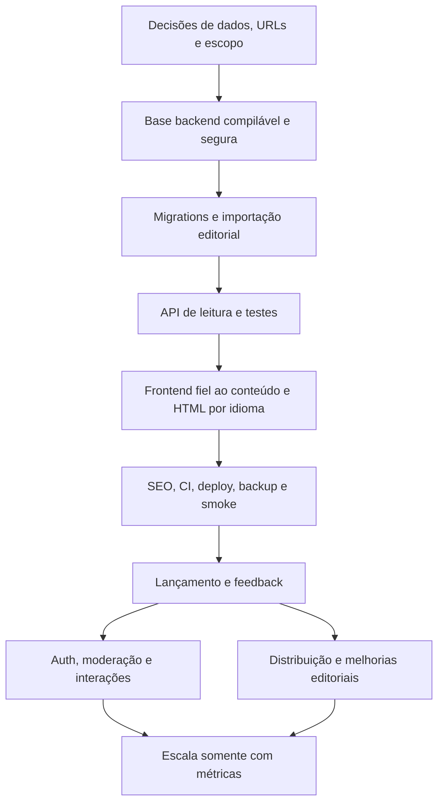

# Roadmap de implementação e lançamento

Data: 8 de setembro de 2026. Plano executável derivado da inspeção do workspace. Esta entrega criou somente documentação; tarefas de implementação abaixo ainda não foram executadas, exceto a análise indicada na Fase 0.

Referências: [frontend](FRONTEND_ANALYSIS.md), [backend](BACKEND_ARCHITECTURE.md) e [SEO/crescimento](GROWTH_SEO_STRATEGY.md).

## 1. Direção e regras de execução

Publicar primeiro uma biblioteca editorial utilizável: quatro artigos reais nos idiomas disponíveis e revisados, duas séries coerentes, leitura pública, API de conteúdo, URLs estáveis e HTML indexável. Abrir comunidade depois, com autenticação, moderação e privacidade implementadas. Não exibir métricas ou sucesso fictícios enquanto funcionalidades não existirem.

Esse recorte é uma recomendação para velocidade. Se comentários, likes e views públicas forem condição da primeira publicação, a Fase 3 passa a fazer parte do lançamento obrigatório e amplia o escopo; não retirar seus controles de segurança para caber no prazo.

Prioridades:

- **P0:** bloqueia o primeiro lançamento editorial.
- **P1:** primeira evolução após lançamento; inclui segurança obrigatória antes de ativar comunidade.
- **P2:** expansão ou otimização conforme demanda; nenhuma tecnologia entra só por estar listada.

Complexidade aproximada: **P** = pequena, geralmente até um dia focado; **M** = média, cerca de 1–3 dias; **G** = grande, vários dias ou mais de uma entrega. São estimativas relativas para uma pessoa, sem garantia de calendário; testes, aprendizado, infraestrutura e revisão podem ampliar o tempo. Não somar linhas como orçamento fechado.

Dependências são IDs de tarefas desta tabela. Trabalho independente pode avançar em paralelo na implementação futura; este planejamento não pressupõe equipe. Concluir uma tarefa exige evidência de aceite, não apenas pastas criadas ou biblioteca instalada.

## Fase 0 — análise

Objetivo: fechar as decisões que mudam dados, URLs, segurança e esforço antes de construir o backend.

| ID | Tarefa / objetivo | Prioridade | Dependências | Complexidade | Motivo |
| --- | --- | --- | --- | --- | --- |
| A00 | Inspecionar frontend/backend e produzir os quatro documentos — **concluído nesta etapa** | P0 | — | G | Basear decisões em código real e separar proposta de implementação |
| A01 | Confirmar recorte editorial P0/comunidade P1 e critérios de lançamento | P0 | A00 | P | Evitar incluir contas, CMS e métricas sem reconhecer custo |
| A02 | Definir domínio/marca, URL `/{locale}/articles/{slug}` e política de tradução ausente | P0 | A00 | P | URLs e identidade editorial precisam ser estáveis antes de divulgar |
| A03 | Confirmar Git/Markdown como fonte única, artigo/tradução separados, tags+séries sem Category | P0 | A01 | P | Evitar duas fontes editáveis e taxonomias redundantes |
| A04 | Decidir preservação de Sequelize simples ou SQL parametrizado; PostgreSQL como banco | P0 | A03 | P | Não implementar duas estratégias de persistência |
| A05 | Registrar ADR de renderização: comparar pré-renderização React/Vite e Next.js; planejar prova de uma rota PT/EN | P0 | A02 | M | Entregar HTML editorial com menor mudança viável; prova com código somente na etapa de implementação autorizada |
| A06 | Definir licença de código/conteúdo/assets, escopo da Apache existente e política de contribuição | P0 | A00 | P | Backend declara ISC e licença está no frontend; abertura precisa ser inequívoca |
| A07 | Definir operador do deploy, contato de segurança/privacidade, orçamento/host e política de backup | P0 | A01 | M | Transformar segurança e operação em responsabilidades concretas |
| A08 | Antes de comunidade, definir moderação, exclusão/retention, métricas públicas e base do identificador de view | P1 | A01, A07 | M | Não coletar dados ou abrir comentários sem finalidade/processo |

Defaults recomendados nos documentos permitem seguir sem debates intermináveis. Decisões de licença, gasto, domínio e enquadramento jurídico dependem do mantenedor; atividades técnicas independentes podem continuar enquanto são fechadas. Não interpretar o plano como autorização para gastos, deploy ou publicação externa nesta etapa.

Aceite da fase: decisões curtas registradas e um escopo que cabe numa primeira entrega. A prova de renderização não deve se transformar numa refatoração de design.

## Fase 1 — Backend MVP

Objetivo: uma fatia editorial completa e segura, da fonte Markdown até uma API pública de leitura, executável em Docker.

| ID | Tarefa / objetivo | Prioridade | Dependências | Complexidade | Motivo |
| --- | --- | --- | --- | --- | --- |
| B01 | Corrigir higiene do repositório: `.env.dev` no índice, ignores, `.env.example`, node_modules/LOGS/IDE e revisão de exposição de secrets | P0 | A00 | M | Ponto de segurança encontrado; resolver antes de tornar público. Rotacionar secrets expostos, sem depender de apagar histórico |
| B02 | Alinhar Node/TypeScript, remover incompatibilidade de baseUrl e criar scripts dev/build/start/typecheck/lint/test | P0 | A04 | M | TSC falha hoje e Docker chama comandos inexistentes |
| B03 | Simplificar runtime: API/PostgreSQL, sem owners event/platform, FFmpeg, worker, uploads e Redis obrigatório | P0 | B02 | M | Remover complexidade sem requisito de blog |
| B04 | Separar app/listener/composição, validar env, payload pequeno, erro consistente, requestId e shutdown | P0 | B02, B03 | M | Base previsível para testes, segurança e operação |
| B05 | Criar migrations do modelo editorial, IDs estáveis, constraints e índices de leitura | P0 | A03, A04, B02 | G | Representar traduções e séries sem duplicação/corridas |
| B06 | Normalizar frontmatter/Markdown dos quatro pares e escrever validador editorial com relatório por arquivo | P0 | A02, A03 | M | Slugs, headings, datas e parser atuais não formam contrato confiável |
| B07 | Implementar importador/PublishTranslation e adapter PostgreSQL transacional, com dry-run/idempotência | P0 | B04, B05, B06 | G | Publicar sem CMS e permitir PRs de conteúdo |
| B08 | Implementar lista/detalhe/tags/séries com locale, visibilidade, projeções pequenas e paginação | P0 | B04, B05, B07 | G | Atender frontend sem expor drafts, ORM ou corpo em todos os cards |
| B09 | Documentar OpenAPI, erros, filtros e exemplos; teste de contrato das respostas reais | P0 | B08 | M | Dar contrato verificável ao frontend e valor educacional à API |
| B10 | Criar testes de publicação, tradução ausente, slug único, ordem, import repetido e queries no PostgreSQL | P0 | B07, B08 | M | Cobrir perda de dados e inconsistências que lint não encontra |
| B11 | Preparar Compose raiz, Dockerfile multi-stage, migrator, seeds locais e health/readiness | P0 | B01, B02, B04, B05, B07 | G | `docker compose up` deve funcionar para leitura sem OAuth ou secrets externos |

Ordem prática: B01 → B02 → B03/B04 → B05/B06 → B07 → B08 → B09/B10/B11. Desenvolver testes junto de cada fatia, não só depois de todas as funcionalidades.

Aceite: em checkout limpo e ambiente local, subir banco/API, migrar/importar duas vezes sem duplicação, consultar artigo PT/EN e série, obter 404 de draft/inexistente e receber erro seguro em payload inválido. Nenhum endpoint administrativo público é exigido; CLI de produção usa acesso operacional protegido.

## Fase 2 — lançamento

Objetivo: conteúdo completo e descobrível, navegação honesta, infraestrutura recuperável e repositório estudável. Esta fase inclui as correções de frontend porque elas bloqueiam a utilidade do backend.

| ID | Tarefa / objetivo | Prioridade | Dependências | Complexidade | Motivo |
| --- | --- | --- | --- | --- | --- |
| L01 | Executar prova de renderização e adotar uma alternativa; preservar React/layout/CSS | P0 | A05, B08 | M | Decidir pelo HTML e custo real, não pelo nome do framework |
| L02 | Implementar rotas localizadas, geração de URLs/alternates, seletor e 404/redirects reais | P0 | A02, L01 | G | Corrigir slugs quebrados e páginas EN que hoje viram home |
| L03 | Substituir parser frágil, preservar tabelas/seções/links e derivar TOC com IDs únicos | P0 | B06, L01 | M | Conteúdo precisa ser fiel ao que o autor aprovou |
| L04 | Integrar home/arquivo/detalhe/séries ao contrato; habilitar TS strict no frontend, corrigir contagem/primeiro item e estados vazios/erro | P0 | B08, B09, L02, L03 | G | Remover dependência de índices fixos e strings de categoria traduzidas |
| L05 | Remover placeholders, newsletter simulada, paginação sem ação, links fictícios e seção vazia de projetos | P0 | A01 | P | Evitar falsas promessas e caminhos inúteis |
| L06 | Corrigir modal/labels/teclado, traduções de UI, autor/datas, tema e leitura móvel | P0 | L02, L03, L04 | M | Acessibilidade e internacionalização precisam funcionar nos fluxos essenciais |
| L07 | Entregar title/description, canonical, hreflang, OG/Twitter, BlogPosting/BreadcrumbList, sitemap e robots | P0 | B08, L02, L03 | M | Conteúdo e compartilhamento precisam ser descobertos corretamente |
| L08 | Otimizar imagens/assets e retirar corpos de todos os artigos do bundle inicial; baseline de laboratório | P0 | L01, L04 | M | Melhorar custo/carregamento sem otimização especulativa |
| L09 | Criar README raiz, CONTRIBUTING, SECURITY, código de conduta, licença definida, templates e ADRs mínimos | P0 | A06, B09, B11 | M | Outra pessoa deve executar, estudar e contribuir sem adivinhar |
| L10 | Publicar Sobre/Privacidade/contato e destino real do GitHub, com inventário de coleta | P0 | A02, A06, A07, L02 | M | Substituir `#top` por transparência e autoria efetiva |
| L11 | Configurar CI sem secrets em PRs e deploy protegido: migrations/import/build/smoke/revisão publicada | P0 | B10, B11, L07, L09 | G | Automatizar repetição segura e detectar divergência API/site |
| L12 | Provisionar hospedagem escolhida, HTTPS/proxy, DB privado, backup externo e teste de restore | P0 | A07, B11, L11 | G | Aplicação no ar precisa sobreviver a falha do host; execução externa requer escopo autorizado |
| L13 | Configurar monitoramento operacional e Search Console; registrar baseline de descoberta | P0 | L07, L12 | M | Identificar indisponibilidade e problemas de indexação sem tracker excessivo |
| L14 | Validar smoke/E2E, HTML sem JS, preview social, 404, idioma, série e teclado; revisão editorial humana | P0 | L04, L05, L06, L07, L08, L10, L12 | M | Build/lint sozinhos não pegam os bugs já encontrados |
| L15 | Lançar com dois pacotes de distribuição, responder feedback e corrigir bloqueadores | P0 | L09, L13, L14 | M | Levar pessoas a uma experiência validada e aprender com uso real |
| L16 | Adotar uma ferramenta de analytics mínima se necessária, com eventos/privacidade testados | P1 | A07, L10, L13 | M | Comparar canais e continuidade quando Search Console não bastar |

Aceite de lançamento: conteúdo correto em URL própria nos idiomas publicados; nada de sucesso fictício; deploy reproduzível; backups restauráveis; projeto público sem secrets conhecidos; canais de contato reais. Correções P0 não exigem reescrever o design inteiro. Esconder recurso incompleto pode ser melhor para o prazo do que implementar funcionalidade nova.

## Fase 3 — comunidade

Objetivo: interações reais, seguras e moderáveis sem impedir leitura pública. As proteções abaixo são obrigatórias **para ativar suas funcionalidades**, mesmo que não bloqueiem o lançamento editorial anterior.

| ID | Tarefa / objetivo | Prioridade | Dependências | Complexidade | Motivo |
| --- | --- | --- | --- | --- | --- |
| C01 | Criar User, ExternalIdentity e Session com índices, expiração e revogação | P1 | A08, B05, B10 | M | Separar identidade externa, perfil editorial e sessão |
| C02 | GitHub OAuth state/PKCE, callback seguro, cookie, `/me` e logout | P1 | C01, L12 | G | Primeiro login sem operar senhas/email; nenhum acesso a repo privado exigido |
| C03 | CSRF, ownership, papéis mínimos, rate limit, bloqueio e bootstrap administrativo seguro | P1 | C02, B04 | G | Evitar que autenticação seja confundida com permissão |
| C04 | Curtida PUT/DELETE idempotente, contagem real e teste concorrente | P1 | C03 | M | Uma conta não pode duplicar like por retry ou corrida |
| C05 | Comentário por tradução, validação/Markdown seguro, edição, exclusão e fila de moderação | P1 | A08, C03 | G | Publicar discussão exige controlar spam, XSS e abuso |
| C06 | Canal de denúncia e auditoria de decisões; bloquear usuário sem editar fala alheia | P1 | C05 | M | Comunidade precisa de resposta humana e rastreabilidade mínima |
| C07 | Views qualificadas com dedupe temporário, agregados, política de identidade e limites documentados | P1 | A08, B05, C01 | G | Evitar contar refresh/build/bots simples como pessoas únicas |
| C08 | UI/endpoint de stats com escopo claro, estado privado separado e interação resiliente | P1 | C04, C05, C07, L04 | M | Mostrar números verdadeiros sem vazar sessão pelo cache |
| C09 | Exclusão de conta, exportação atendível, cleanup/retenção e política pública atualizada | P1 | A08, C01, C04, C05, C07 | G | Preparar direitos e ciclo de vida dos dados antes de coleta ampla |
| C10 | Testar auth/CSRF/XSS/ownership, rollback/dedupe e fluxo de moderação; ativar gradualmente | P1 | C02, C03, C04, C05, C06, C07, C08, C09 | M | Evidenciar segurança das fronteiras e operação humana |

Aceite: usuário ativo consegue curtir/descurtir e comentar; outro usuário não edita o comentário; logout/bloqueio revogam acesso; moderação altera a visibilidade; contagens explicam idioma/dedupe; exclusão tem resultado definido e testado. Visitante continua lendo sem conta.

Conta própria não precisa bloquear esse primeiro login, mas é parte do produto futuro para pessoas sem GitHub. Se a barreira de GitHub prejudicar o público inicial, antecipar G04 com seu pacote completo.

## Fase 4 — crescimento

Objetivo: melhorar aprendizagem, descoberta e participação com base no uso, sem adicionar simultaneamente todas as ideias.

| ID | Tarefa / objetivo | Prioridade | Dependências | Complexidade | Motivo |
| --- | --- | --- | --- | --- | --- |
| G01 | Executar revisão semanal de descoberta, feedback e distribuição; manter ficha por artigo | P1 | L15, L13 | P recorrente | Escolher temas e canais por evidência, não só inspiração |
| G02 | Fortalecer séries e linking interno; atualizar textos com maior demanda/lacunas | P1 | G01 | M recorrente | Continuidade e exercício agregam valor antes de recomendação automática |
| G03 | Melhorar busca: parâmetros/normalização e depois full-text PostgreSQL por idioma se necessário | P2 | B08, G01 | M | Catálogo pequeno não precisa mecanismo externo; expandir quando houver dificuldade real |
| G04 | Conta própria com confirmação/reset, Argon2id, email confiável e vinculação segura | P2 | C03, C09, G01 | G | Incluir leitores sem GitHub sem lançar senha incompleta |
| G05 | Respostas limitadas, progresso explícito e favoritos — escolher por demanda, entregar separadamente | P2 | C05, C10, G01 | G | Ajudar estudo recorrente sem transformar blog em rede social |
| G06 | RSS e/ou newsletter real com opt-in e descadastro quando houver interesse recorrente | P2 | G01, L10 | M | Criar retorno útil; não restabelecer formulário sem entrega |
| G07 | Onboarding de traduções/correções e questões pequenas para contribuidores | P1 | L09, G01 | M | Transformar feedback em contribuição de baixo atrito |
| G08 | Testar mídia paga em um canal/idioma/landing, com orçamento explicitamente definido e regra de parada | P2 | L16, G01, G02, L14 | M | Validar aquisição qualificada após provar conteúdo; gasto não autorizado por este documento |
| G09 | Publicar estudo de caso do blog com ADRs, testes, limites e resultados agregados | P1 | L15, C10 ou entregas reais disponíveis | M | Portfólio precisa demonstrar trabalho concluído, não lista de tecnologias |
| G10 | Avaliar CMS/painel editorial apenas se Git/PR impedir contribuições; definir nova fonte única | P2 | G07, A03 | G | Resolver gargalo editorial real sem criar edição concorrente Git/banco |

Aceite: capacidade de apontar o que melhora o entendimento/continuidade, quais canais trazem leitores interessados e onde vale investir esforço. A estratégia de [90 dias](GROWTH_SEO_STRATEGY.md#12-estratégia-para-os-primeiros-90-dias) detalha cadência e experimentos; não é obrigação entregar todas as tarefas G em 90 dias.

## Fase 5 — escala

Objetivo: responder a gargalos medidos. Não tem data fixa nem bloqueia conteúdo/comunidade.

| ID | Tarefa / objetivo | Prioridade | Dependências | Complexidade | Motivo |
| --- | --- | --- | --- | --- | --- |
| E01 | Medir carga representativa, p95/p99, pool, queries, erros e custo por rota | P2 | L13, volume real | M | Separar gargalo de banco, CPU, payload, rede ou código |
| E02 | Corrigir N+1, índices/queries e cache HTTP/CDN com invalidação clara | P2 | E01 | M | Otimização local geralmente antecede nova infraestrutura |
| E03 | Adicionar Redis para caso comprovado: rate limit compartilhado/cache/dedupe | P2 | E01, E02 | G | Só compensa quando benefício paga operação e consistência adicional |
| E04 | Adicionar fila/worker ou outbox/job confiável para tarefa assíncrona identificada | P2 | E01, tarefa com backlog/retry | G | Tirar trabalho demorado do request sem importar worker legado |
| E05 | Escalar API horizontalmente e ajustar orçamento de conexões; PgBouncer se necessário | P2 | E01, E02, C01 se auth ativa | G | Aumentar capacidade/continuidade sem perder sessão nem saturar DB |
| E06 | Evoluir tracing, alertas/SLO, restore/PITR e ensaio de falhas | P2 | E01, L12 | G | Observabilidade adicional só vale se apoiar recuperação/operação |
| E07 | Avaliar busca externa, réplica de leitura ou particionamento separadamente | P2 | E01, E02 e limite comprovado da solução atual | G | Cada serviço resolve gargalo específico, não crescimento abstrato |

Gate: escrever evidência do problema, opções consideradas, custo operacional e métrica esperada antes da mudança. Kubernetes, Kafka, sharding e microserviços não estão na fila de implementação atual.

## 2. Caminho crítico resumido

A correção de secrets/ignore é imediata e pode acontecer antes das outras decisões na etapa de implementação. Remoção de UI fictícia e revisão de conteúdo podem avançar enquanto API/renderização são construídas. Não iniciar sessão/likes antes de resolver identidade de artigo/tradução e não divulgar URLs que serão descartadas na semana seguinte.

## 3. Pacotes sugeridos de entrega

PRs futuros pequenos, cada um verificável:

1. Higiene e toolchain: B01–B04, sem features editoriais.
2. Modelo editorial e importação de um artigo em dois idiomas: B05–B07 e testes correspondentes.
3. API pública e séries reais: B08–B10, ampliando importação para os quatro artigos.
4. Ambiente local/Docker executável: B11, com README do setup.
5. Rota pré-renderizada PT/EN, 404 e Markdown fiel: L01–L03.
6. Integração e remoção de demo: L04–L06.
7. Metadata, assets, documentação e operação: L07–L14, subdivididos conforme tamanho.
8. Lançamento e primeiro feedback: L15; depois cada capacidade da comunidade em PR próprio.

Não é necessário esperar um “framework hexagonal completo” antes de importar e consultar o primeiro artigo. A fatia vertical demonstra onde ports são úteis e revela abstrações que ainda não precisam existir.

## 4. Definição de pronto e limites da análise

Uma tarefa de código está pronta quando resolve o fluxo, tem validação proporcional ao risco, documentação relevante atualizada e nenhuma funcionalidade fictícia apresentada como concluída. Uma tarefa operacional exige verificação do ambiente e recuperação, não só arquivo Docker no Git. Uma tarefa de crescimento exige hipótese, material publicado quando autorizado e análise de resultado; produzir carrossel sem destino útil não conclui aquisição.

Nesta etapa foram concluídos: leitura do projeto, auditoria de código/estrutura, build e lint do frontend, checagem de tipos do backend (falhou por baseUrl), consulta de fontes e os quatro documentos. Não foram realizados: refatoração, implementação de backend, deploy, campanha, alteração de credenciais, remoção de arquivos do usuário, teste visual/browser, carga ou auditoria jurídica.

Primeira ação técnica recomendada para a próxima etapa: B01/B02, seguida da fatia editorial com um artigo em PT/EN. A arquitetura deve crescer a partir desse fluxo funcionando.
