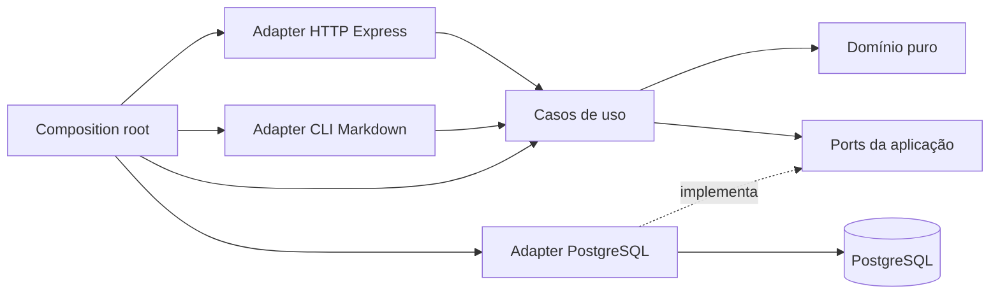
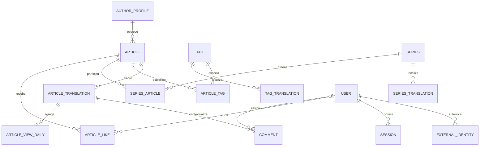
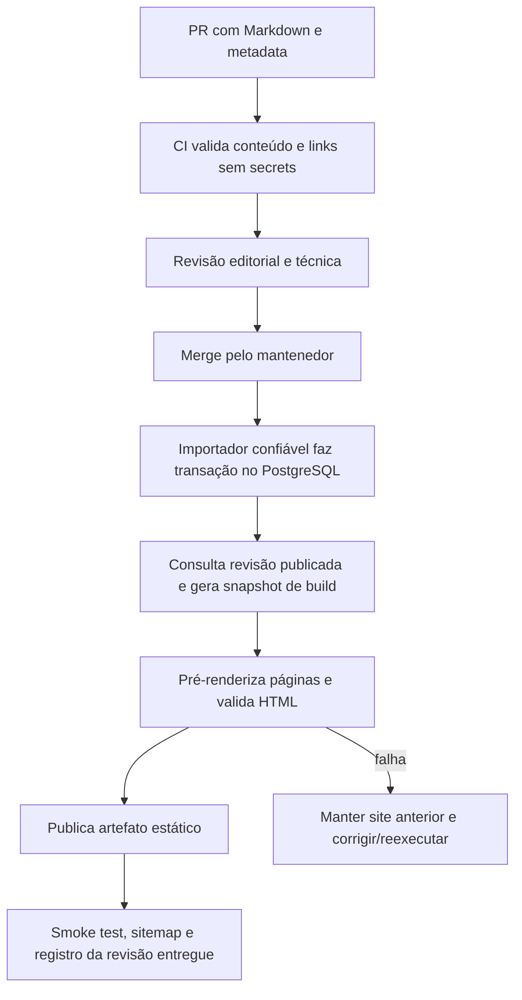
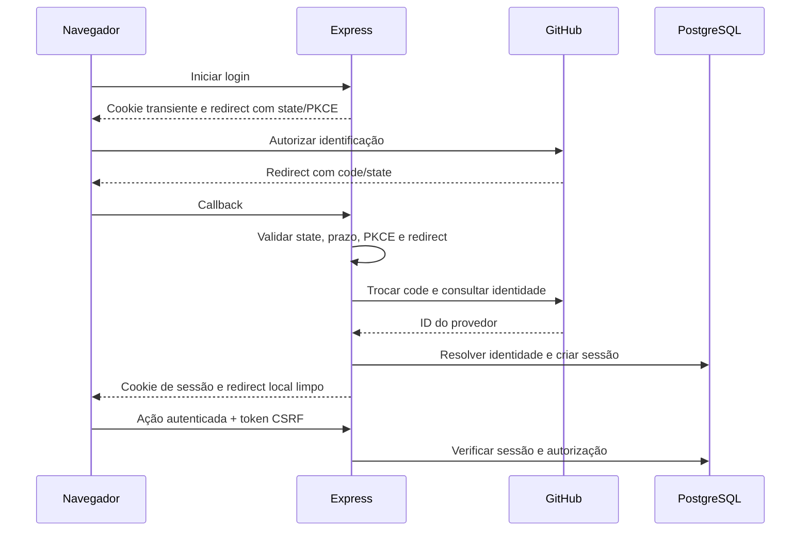

# Arquitetura e plano do backend

[Comece aqui — guia de leitura e execução](./00_COMECE_AQUI.md)

Data: 8 de setembro de 2026. Documento de decisão e planejamento, sem implementação nesta etapa. Baseado nos arquivos locais de `/frontend` e `/backend`, com fontes oficiais consultadas para aspectos técnicos e regulatórios. Leia também [frontend](../FRONTEND_ANALYSIS.md), [crescimento e SEO](../GROWTH_SEO_STRATEGY.md) e [roadmap](../ROADMAP.md).

Atalhos: [auditoria existente](#2-estado-real-do-backend-e-auditoria-inicial), [hexagonal](#3-arquitetura-hexagonal-adequada-com-limites), [modelo de dados](#5-banco-e-modelo-conceitual), [publicação](#8-fonte-editorial-e-fluxo-de-publica%C3%A7%C3%A3o), [API](#9-rest-e-contrato-da-api), [autenticação](#10-autentica%C3%A7%C3%A3o-e-sess%C3%B5es), [segurança](#15-seguran%C3%A7a-de-uma-aplica%C3%A7%C3%A3o-com-c%C3%B3digo-p%C3%BAblico), [privacidade](#16-privacidade-e-lgpd), [checklist](#backend-mvp-checklist).

## 1. Produto, recorte e decisões principais

Construir uma biblioteca educacional aberta, multilíngue, com trilhas de leitura e participação comunitária. Leitura será pública. O projeto ensinará também pela clareza dos casos de uso, testes, documentação e decisões, sem precisar simular infraestrutura de uma empresa grande.

Recomendação: **monólito modular em Node.js, TypeScript e Express, com Arquitetura Hexagonal leve, PostgreSQL e Docker**. Fonte editorial versionada em Markdown; banco como projeção de publicação e armazenamento das futuras interações. Frontend React entrega conteúdo pré-renderizado e usa API para funcionalidades dinâmicas.

### Entregas e limites

| Entrega | Inclui | Não bloqueia essa entrega |
| --- | --- | --- |
| P0 — MVP editorial | Importar/revisar/publicar artigos PT/EN; metadados; tags; séries ordenadas; API pública de leitura; HTML indexável; segurança operacional; backup; documentação | Contas públicas, comentários, curtidas e views próprias |
| P1 — primeira comunidade | GitHub login, sessão, logout, curtidas, comentários moderáveis, views públicas com semântica documentada, exclusão de conta | Conta local, threads profundas, progresso, recomendações personalizadas |
| P2 — expansão | Email/senha com ciclo completo, contribuições editoriais pelo app se úteis, progresso, busca avançada e escala comprovada | Microserviços, Kubernetes e mensageria sem gargalo |

O usuário deseja as três métricas públicas no produto. Elas não foram descartadas: serão entregues juntas da comunidade. Separar o MVP editorial é a recomendação para publicar rapidamente e corresponde às fases solicitadas. Caso a primeira publicação precise obrigatoriamente incluir essas métricas, antecipar **todo** o pacote P1, inclusive controle de abuso, moderação e privacidade, em vez de exibir números fictícios.

Preparar agora: identidade do artigo separada da tradução, IDs estáveis, URLs por locale, constraints relacionais, fronteiras HTTP/persistência, fluxo de publicação e migrations. Não criar tabelas vazias de toda evolução apenas para “deixar pronto”.

## 2. Estado real do backend e auditoria inicial

O diretório não está vazio. Há Express, configuração de ambiente, CORS, Helmet, cookie-parser, Sequelize/PostgreSQL, DI com tsyringe, decorators de log, contexto de transação, tratamento de erros, health router e Dockerfiles. Não foram encontrados modelos de blog, migrations de blog, casos de uso editoriais, autenticação ou rotas de artigos ativas. `getModelsForCurrentDeployable` retorna lista vazia; `Server.router()` contém apenas comentários.

O padrão de nomes `event`, `platform`, `participantId`, worker de eventos, FFmpeg e uploads sugere reaproveitamento de outra base. A origem não foi confirmada; o fato verificável é que esses conceitos não correspondem aos fluxos de blog encontrados.

### Achados concretos

| ID / prioridade | Caminho relativo à raiz | Problema / impacto | Recomendação |
| --- | --- | --- | --- |
| B01 / P0 | `backend/.env.dev`, índice Git; `.gitignore` da raiz ausente no workspace | Arquivo de ambiente está staged/rastreado. `backend/node_modules`, `LOGS` e IDE aparecem sem proteção global adequada. Não foi verificado se há credenciais válidas ou se foram enviadas ao remoto | Antes de abrir/publicar, revisar índice e histórico, retirar secrets do versionamento, adicionar regras e `.env.example`; rotacionar qualquer segredo que tenha sido exposto. Não basta ignorar arquivo já rastreado |
| B02 / P0 | `backend/package.json`, `backend/tsconfig.json:16` | `npx --no-install tsc --noEmit` falhou: `TS5102: Option 'baseUrl' has been removed`. Checagem não avançou para validar o restante | Alinhar configuração ao compilador escolhido e testar aliases no JS compilado; não mascarar o erro com skipLibCheck |
| B03 / P0 | `backend/package.json`, `backend/Dockerfile`, `backend/Dockerfile.develop`, `backend/docker-compose-develop.yml` | Docker chama `build`, `migrate`, `start:monolith`, `dev:monolith:develop`, `dev:event-worker`; esses scripts não existem. Só há `dev:monolith:dev` e teste placeholder | Definir contrato simples de comandos dev/build/start/test/migrate/seed; verificar imagem de ponta a ponta |
| B04 / P0 | `backend/docker-compose-develop.yml`, `backend/src/bootstrap/env.ts` | Compose usa `NODE_ENV=develop`, arquivo `.env.dev`, bootstrap procura `.env.develop`; execução fora do Compose depende de cwd. `env_file` do serviço não resolve sozinho `${...}` do YAML | Padronizar ambiente e diferenciar interpolação do Compose de env do container |
| B05 / P0 | `backend/src/framework/http/server.ts`, `backend/src/infrastructures/persistence/ORM/index.sequelize.ts`, `backend/src/index.ts` | Falhas de conexão/start são capturadas sem propagação; `Database.connect()` pode resolver apesar da falha e API tentar escutar | Falhar startup com exit não zero; readiness só quando dependências necessárias estiverem prontas |
| B06 / P0 | `backend/src/framework/http/server.ts`, `healthCheck.route.ts` | Health router existe mas montagem está comentada; não há endpoints de domínio ativos | Separar app de listener, montar `/health/live` e `/health/ready` com contrato real |
| B07 / P0 | `backend/src/framework/http/server.ts` | Limite JSON `100mb`, `trust proxy=true` sem topologia documentada; middleware de request log comentado | Reduzir limite por rota; confiar somente no proxy real; requestId no início da requisição |
| B08 / P0 | `backend/docker-compose-develop.yml`, Dockerfiles | Redis obrigatório, worker de eventos, volume de uploads e FFmpeg não atendem requisito atual | Remover da proposta de runtime inicial; manter API e PostgreSQL |
| B09 / P0 | `backend/Dockerfile.develop`, ausência de `.dockerignore` | `COPY . .` pode incluir `.env.dev`, dependências locais e arquivos desnecessários no contexto/imagem | Excluir secrets e artefatos do contexto; montagem local deliberada; imagem final sem credenciais |
| B10 / P0 | `backend/Dockerfile` | Sem `USER` não privilegiado, scripts inexistentes, FFmpeg, dependências de desenvolvimento classificadas em runtime | Multi-stage simples, usuário não root e produção executando JS compilado |
| B11 / P0 | `backend/src/infrastructures/persistence/ORM/index.sequelize.ts` | `SYNC=true` ativa sync; não há migrations encontradas. `getInstance` chama `auditHook` em toda obtenção, podendo registrar hooks repetidos | Migration explícita; registrar configuração uma vez; não confiar em sync de produção |
| B12 / P1 | `backend/src/infrastructures/persistence/ORM/unitOfWork/*`, `context/*` | Unidade de trabalho genérica com `executeWithEventOperationalLock`, transação implícita via ALS e tipos Sequelize nas interfaces | Remover regra de eventos; preferir operação transacional explícita no adapter de publicação |
| B13 / P1 | `backend/src/infrastructures/di/container/config.container.ts` | `ILogger` registrado duas vezes; container registra abstrações ainda sem caso de uso do blog | Composição manual; eliminar registros concorrentes e singletons ocultos conforme simplificar |
| B14 / P0 | `backend/src/infrastructures/logger/process-error-handlers.ts` | `uncaughtException` só define exitCode; com listener ativo processo pode continuar. Rejeição apenas loga | Encerramento controlado com timeout e supervisor reiniciando; não continuar após falha fatal |
| B15 / P1 | `backend/src/infrastructures/logger/logger.ts`, `formatter/logger.formater.ts`, `context/request.context.ts` | JSON estruturado/redação já existem, mas também arquivos locais, data fixada na criação do logger e `participantId` legado; request middleware ausente | Aproveitar contrato JSON e redação; stdout, requestId real, rotação/retenção fora do processo |
| B16 / P1 | `backend/src/shared/errors/application.error.ts` | Erro de aplicação exige `statusCode`, acoplando aplicação ao transporte | Erros semânticos na aplicação; adapter HTTP mapeia status |
| B17 / P0 | `backend/src/shared/middlewares/errorHandler.middleware.ts` | Trata JSON inválido, mas erros de tamanho excedido não têm mapeamento específico; requestId pode não existir | Respostas consistentes 400/413/500; respeitar `headersSent`; log não deve impedir resposta |
| B18 / P0 | `backend/package.json` | Teste placeholder; não há scripts CI/build. Duas bibliotecas de status HTTP; import de `reflect-metadata` sem dependência direta declarada | Menor conjunto de dependências, classificação dev/runtime e instalação reproduzível |

A configuração CORS usa allowlist e não wildcard com credentials, o que é positivo. Helmet e a redação de campos sensíveis também são aproveitáveis. Não existe evidência de que essas medidas cubram autenticação, CSRF ou todos os logs. O conteúdo de `.env.dev` e logs pessoais não foi incluído na documentação.

Não foram iniciados containers, aplicadas migrations ou feitas chamadas ao banco nesta auditoria. A falha de TypeScript e os scripts inexistentes já impedem afirmar que o backend está executável. Frontend build/lint passaram; isso não valida o backend.

## 3. Arquitetura Hexagonal: adequada com limites

A arquitetura resolve um problema real aqui: escrever regras editoriais e comunitárias sem depender de Express ou Sequelize, permitindo testar publicação e permissões diretamente. Outra porta de entrada importante já tem motivo concreto: um comando CLI importa Markdown, enquanto HTTP serve leitura.

Não implica “uma interface para cada classe”. Regra de projeto: abstrair **fronteiras externas ou operações de negócio estáveis**, e não cada função utilitária.

| Abordagem | Benefício | Custo | Adequação |
| --- | --- | --- | --- |
| Express com handlers consultando ORM | Muito rápido para protótipo | Mistura autorização, HTTP e banco; regras difíceis de exercitar isoladamente | Aceitável para endpoints triviais, não padrão de publicação/comunidade |
| Camadas controller/service/repository | Familiar, organização simples | Pode virar CRUD genérico ou services sem intenção | Alternativa válida se dependências forem disciplinadas |
| Hexagonal leve dentro de módulos | CLI e HTTP reutilizam casos de uso; banco é detalhe; didática clara | Algumas ports e DTOs explícitos | **Recomendação** |
| Clean Architecture com múltiplas camadas equivalentes | Pode servir domínio maior | Mapeamentos e pastas duplicadas sem benefício agora | Evitar cerimônia adicional |
| Microserviços/CQRS com buses/event sourcing | Isolamento e modelos especializados | Operação, consistência distribuída, tracing e deploys extras | Sem justificativa atual |

### Estrutura proposta

Árvore de destino para implementação gradual. Pastas de identidade/comunidade só são criadas quando suas funcionalidades começarem.

```text
backend/
  src/
    main.ts                       inicia e encerra o processo
    config/env.ts                 valida ambiente, sem importar em domínio
    composition.ts                conecta adapters e casos de uso
    http/
      app.ts                      monta Express, sem listen
      error-handler.ts            códigos internos -> HTTP
      request-context.ts          requestId e contexto de log
      health.routes.ts
    modules/
      publishing/
        domain/
          article.ts              identidade e invariantes editoriais
          publication-policy.ts   regras puras que justificarem extração
        application/
          import-content.ts       importa uma edição validada
          publish-translation.ts
          get-article.ts
          list-articles.ts
          get-series.ts
          ports/
            publication-store.ts  gravação atômica de conteúdo editorial
            article-reader.ts     projeções de leitura, sem ORM
        adapters/
          http/articles.routes.ts
          http/article.schemas.ts
          cli/import-content.ts   filesystem/frontmatter -> input do caso de uso
          postgres/publication-store.ts
          postgres/article-reader.ts
      identity/                   P1: domínio/aplicação/adapters da identidade
      community/                  P1: comentários, likes e métricas públicas
    infrastructure/
      database.ts                 pool/Sequelize e encerramento
      logger.ts                   JSON para stdout
  migrations/
  seeds/
  scripts/                        tarefas operacionais pequenas
  tests/
    unit/
    integration/
    api/
  Dockerfile
  .dockerignore
  .env.example
```

Na raiz futura: `compose.yaml`, README, documentos e diretório editorial compartilhado, por exemplo `content/articles/<articleId>/<locale>.md`. Os Markdown estão hoje em `frontend/artigo`; essa mudança de localização é proposta, não executada. Não é necessário adotar workspaces ou um monorepo manager para dois package.json.

### Responsabilidades e dependências



Setas representam dependências de código. Em runtime, o caso de uso chama o adapter através da port injetada. Domínio não importa Express, container DI, Sequelize, filesystem, variáveis de ambiente ou sessão. Aplicação coordena autorização e transação por capacidades, sem conhecer `Request`, `Response` ou `Transaction` do ORM.

Exemplo didático: `publishTranslation(input, dependencies)` recebe dados já validados estruturalmente e identidade do operador; verifica publicação, idioma e integridade da série; chama `publicationStore.publish(...)`. O adapter executa transação real e traduz conflito de constraint para erro semântico. Isso já demonstra inversão de dependência; não precisa de decorator `@UseCase`, interface de controller ou bus.

### Ports que têm propósito

| Port | Quando | Operações aproximadas |
| --- | --- | --- |
| `PublicationStore` | P0 | Importar/upsert de revisão e publicação em transação, preservando IDs |
| `ArticleReader` | P0 | Buscar detalhe publicado, listar resumos e obter série ordenada |
| `IdentityStore` / `SessionStore` | P1 | Encontrar identidade externa, criar/revogar sessão |
| `OAuthIdentityProvider` | P1 | Trocar código e obter identidade verificada do GitHub |
| `CommentStore`, `LikeStore` | P1 | Operações específicas com invariantes e constraints |
| `ViewRecorder` | P1 | Registrar observação deduplicada de acordo com uma política versionada |
| `PasswordHasher`, `EmailSender` | P2, antes de conta própria | Hash/verify e envio de mensagens transacionais |
| Relógio como função injetada | Quando testes de expiração/status exigirem | `now()`; sem hierarquia de relógios |

Ports devem usar tipos da aplicação, não filtros ORM genéricos. `ArticleReader` pode retornar projeções prontas e fazer joins eficientes; não hidratar dezenas de entidades para montar um card. Ter leitura e escrita com necessidades distintas não obriga CQRS distribuído.

Abstrações desnecessárias: `BaseRepository<T>`, interfaces espelhando cada classe, service que só repassa para outro service, mapper de uma linha obrigatório, `UnitOfWork` universal com transação implícita, domínio rico com getters para todo campo, decorator para toda função, bus de comandos/eventos e um pacote shared que conhece todos os módulos.

Começar publicação com uma operação transacional explícita no adapter. Extrair `TransactionRunner` só quando múltiplos casos de uso precisarem coordenar várias ports e houver implementação que garanta o mesmo contexto de transação. Não injetar um suposto UoW que abre transação, mas deixa repositories usando conexões independentes.

## 4. Tecnologias e custos

| Tecnologia | Problema resolvido / custo | Decisão |
| --- | --- | --- |
| Node.js + TypeScript strict | Uma linguagem no projeto e contratos explícitos; exige build/toolchain coerente | P0, versão suportada fixada em desenvolvimento/CI/Docker |
| Express | API HTTP pequena e explícita; requer montar validação e segurança | P0, manter preferência do projeto |
| PostgreSQL | Relações e unicidade/transações reais; exige backup, migrations e operação | P0 |
| Sequelize já instalado | Reutiliza experiência e dependência presente; decorators/generic helpers não são obrigatórios | Manter como adapter se resolver toolchain e migrations; não trocá-lo por moda |
| `pg` com SQL parametrizado | SQL didático e controle direto; mais mapeamento manual | Alternativa se simplificar a base antes de criar models |
| Prisma/Drizzle | Tipagem e ferramentas de schema; nova dependência e aprendizado | Alternativas válidas, sem necessidade demonstrada de migração agora |
| Validador de payload/frontmatter | Tipos TS não protegem dados externos; schema adiciona manutenção pequena | P0; escolher uma biblioteca mantida e usá-la nas bordas |
| Logger JSON existente simplificado ou Pino | Diagnóstico e estrutura; logger próprio completo tem custo de manutenção | P0: manter formato e redação; uma biblioteca pode substituir plumbing |
| OpenAPI | Contrato testável e material educacional; precisa acompanhar API | P0; Swagger UI local opcional |
| Docker Compose | Setup reprodutível; exige imagem e bootstrap coerentes | P0 |
| Redis | Estado temporário compartilhado e cache em escala | Não usar P0; sessão pode ficar no PostgreSQL |
| Fila/worker | Retries, tarefas demoradas e assíncronas | Adicionar sob demanda; não portar worker legado |
| GraphQL | Consultas flexíveis para clientes diversos | Desnecessário para um cliente e recursos pequenos |

Fixar versão e lockfile, verificar suporte/compatibilidade quando implementar. Esta análise verificou o erro local do TypeScript, não certificou disponibilidade de cada versão declarada no registry. Não instalar dependências durante o planejamento.

## 5. Banco e modelo conceitual

### Comparação

| Banco | Vantagens aqui | Custos/limites | Escolha |
| --- | --- | --- | --- |
| PostgreSQL | FKs, joins, transações, índices compostos, full-text e contagens consistentes | Serviço a administrar; planejar conexões e backups | Recomendado |
| SQLite | Excelente setup local e site de um processo; baixo custo | Concorrência de escrita, arquivo persistente e múltiplas réplicas exigem cuidados; testes podem divergir do banco de produção | Bom para blog estritamente estático, não primeira escolha com comunidade planejada |
| MySQL/MariaDB | Relacional maduro e atende o domínio | Não traz vantagem clara sobre a dependência PostgreSQL existente | Alternativa se houver experiência/hospedagem já definida |
| MongoDB | Documento editorial flexível | Relações de traduções, séries, likes únicos e moderação continuam existindo; necessidade de consistência não desaparece | Não há razão forte para escolher |
| Plataforma gerenciada com PostgreSQL | Reduz tarefas de backup/operação | Custo recorrente, limites e serviços específicos | Boa opção de produção; manter domínio independente do fornecedor |

Busca textual e índices GIN são recursos nativos do PostgreSQL; podem evitar um serviço externo quando o catálogo crescer. Não significam que um índice full-text seja necessário para quatro artigos. [Documentação PostgreSQL](https://www.postgresql.org/docs/current/textsearch.html).

### Entidades P0

| Entidade | Dados conceituais | Regras |
| --- | --- | --- |
| `Article` | `id`, `sourceLocale`, `authorId`, `difficulty`, `createdAt`, `archivedAt?` | Identidade editorial independente do idioma; um autor principal inicialmente; arquivar remove todas as traduções da exposição pública |
| `ArticleTranslation` | `id`, `articleId`, `locale`, `slug`, `title`, `description`, `bodyMarkdown`, `status`, `publishedAt?`, `updatedAt`, `sourceRevision`, `translatedFromRevision?`, `readingMinutes`, `seoTitle?`, `seoDescription?`, `socialImagePath?`, `imageAlt?` | Uma por artigo/locale; publicação independente; slug único por locale; texto revisado |
| `AuthorProfile` | `id`, `displayName`, `bio`, `profileSlug`, `avatarPath?`, links públicos | Autoria pública não exige conta de login. Começar com o mantenedor; ligação opcional com User só em P1 |
| `Tag` | `id`, `key` estável | Conceito independente de grafia; uma tecnologia não vira duas tags por idioma |
| `TagTranslation` | `tagId`, `locale`, `name`, `slug`, `description?` | Página localizada só para entradas válidas; termos técnicos podem manter o mesmo nome |
| `ArticleTag` | `articleId`, `tagId` | PK composta, associação compartilhada pelas traduções |
| `Series` | `id`, `status`, `difficulty?`, `createdAt`, `updatedAt` | Trilha editorial, não mero rótulo; draft/published/archived |
| `SeriesTranslation` | `seriesId`, `locale`, `slug`, `title`, `description`, `prerequisitesText?`, `status` | Tradução da apresentação da série; só publicar página localizada revisada |
| `SeriesArticle` | `seriesId`, `articleId`, `position` | N:N e ordem por série; membro único e posição positiva/única |

Não criar `Content` genérico separado de `ArticleTranslation` agora: o corpo é um campo da tradução. Não criar `Language` com dezenas de atributos: usar BCP 47 e allowlist configurada (`pt-BR`, `en` inicialmente), armazenado como texto validado. Não usar enum SQL fechado em dois idiomas. Não criar Category no MVP; tags e séries cobrem o frontend útil. Não há entidade Project necessária para página estática de portfólio.

Se o primeiro MVP tiver apenas um autor e o prazo for extremamente curto, a autoria pode começar como configuração editorial validada. A tabela `AuthorProfile` é a preferência por tornar o contrato estável e permitir contribuições sem exigir contas. Coautoria e tradutores creditados podem começar em metadados públicos revisados; só criar `ArticleContributor` quando houver atribuições múltiplas reais a gerenciar.

### Entidades P1/P2, não obrigatórias nas migrations iniciais

| Entidade | Finalidade e restrições |
| --- | --- |
| `User` | ID, nome público, email opcional/privado, emailVerifiedAt, role simples, status active/blocked/deletion_pending, timestamps |
| `ExternalIdentity` | userId, provider, providerUserId como texto; UNIQUE(provider, providerUserId). Não usar login mutável do GitHub como identidade |
| `Session` | hash de token opaco aleatório, userId, createdAt, expiresAt, lastSeenAt, revokedAt; PK/UNIQUE do hash e índice de expiração |
| `ArticleLike` | PK(articleId,userId), createdAt. Uma curtida por conta e artigo, compartilhada entre idiomas |
| `Comment` | id, translationId, userId anulável após exclusão, bodyMarkdown, status, createdAt, updatedAt, deletedAt; parentId somente ao adicionar respostas |
| `ViewDeduplication` | Chave temporária HMAC, translationId, janela, expiresAt. UNIQUE(chave,translationId,janela). Não é histórico de pessoas |
| `ArticleViewDaily` | translationId, dateUTC, countAccepted, metricVersion; unicidade por tradução/dia/versão |
| `ModerationAction` | Quem moderou, alvo, ação, motivo, timestamp; acesso restrito e retenção definida |
| `Report` | P1 após comentários ou início P2: alvo, denunciante, motivo categorizado, status; unicidade de denúncia aberta por conta/alvo |
| `LocalCredential` | P2: userId único, passwordHash, changedAt; conta OAuth não precisa de senha vazia |
| `AccountToken` | P2: userId, purpose, hash, expiresAt, consumedAt para confirmação/reset; tokens de propósito distinto |
| `ReadingProgress` | P2: userId, articleId, completedAt; progresso por artigo, não cadastro de todos os scrolls |
| `ArticlePrerequisite` | P2 se referências em texto não bastarem; evitar ciclos e autorreferência |

Não armazenar uma linha eterna `View` para cada request. O produto precisa de contagens públicas explicáveis; retenção de eventos brutos deve ter necessidade própria.



Diagrama conceitual inclui o destino P1, não indica criar todas as tabelas em P0. Article deve ter uma tradução de origem criada na mesma transação; FKs sozinhas não garantem a existência de ao menos uma tradução. A relação User–Comment admite autor nulo depois da exclusão da conta; comentários anônimos não são aceitos na criação.

### Integridade, índices e concorrência

- IDs UUID gerados uma vez e preservados entre imports. Não deduzir ID pelo título ou slug. UUID não substitui autorização.
- UNIQUE(articleId, locale) e UNIQUE(locale, slug) em traduções; slug reservado também quando draft para evitar conflito tardio.
- Slug é segmento, não caminho; normalização e tamanho máximo; comparar em formato canônico. Manter rota antiga em `ArticleSlugRedirect` quando ocorrer a primeira alteração de slug publicado; unicidade global de caminho localizado entre slugs atuais e aliases precisa ser validada transacionalmente, não só em duas tabelas separadas.
- PK composta nas associações. `SeriesArticle` tem UNIQUE(seriesId,position); reordenação em transação, com constraint adiada ou atualização sem colisões temporárias.
- Índice de lista publicada `(locale, publishedAt DESC, id DESC)` condicionado a status published; filtrar também arquivamento do Article.
- Índices nas FKs consultadas; PK(articleId,tagId) não cobre consulta eficiente iniciada apenas por tagId, então criar reverso conforme query.
- Comentários por `(translationId,status,createdAt,id)`; likes por articleId já se beneficiam do primeiro componente da PK; índice reverso por userId atende exclusão/exportação.
- Datas em `timestamptz`, UTC na API e `Intl.DateTimeFormat` no frontend. Data editorial não é a data de deploy.
- Validação de schema na entrada e constraints no banco. Checar duplicidade só com SELECT antes do INSERT não impede corrida.
- Contagens agrupadas por página ou join/subquery, sem um SELECT extra por card. Nada de ORM carregando corpo Markdown na listagem.
- `EXPLAIN (ANALYZE, BUFFERS)` em ambiente de teste com volume representativo quando uma query for lenta; não criar índices em todas as colunas.

## 6. Internacionalização e identidade editorial

`Article` responde “qual é este conteúdo?”. `ArticleTranslation` responde “como ele é apresentado neste idioma?”. As traduções compartilham identidade, autor principal, tags, dificuldade e posição em séries; possuem título, corpo, slug, descrição, status e datas próprios. Isso evita duplicar o grafo do artigo inteiro a cada idioma.

Contrato inicial de URLs: `/{locale}/articles/{slug}`, `/{locale}/series/{slug}` e `/{locale}/tags/{slug}`. Exemplo PT: `/pt-BR/articles/javascript-typescript-sem-misterio`; EN: `/en/articles/javascript-typescript-demystified`. A convenção pode ser alterada antes do primeiro lançamento; depois, mudanças exigem redirects permanentes.

Regras propostas:

1. Locale é BCP 47, normalizado por configuração; rejeitar valores desconhecidos e traversal. Adicionar idioma exige traduções de UI e conteúdo, não alterar todas as entidades.
2. Detail query com locale/slug só retorna tradução publicada e Article ativo. Tradução ausente responde 404 com navegação útil para versões existentes; não servir PT silenciosamente sob `/en`.
3. API de identidade pode informar alternates publicados, sem expor rascunhos. Seletor utiliza esses links, não substituição textual do slug.
4. Canonical é a URL limpa da própria tradução; URLs de tracking apontam para ela. Hreflang relaciona somente versões publicadas e acessíveis, com reciprocidade e autorreferência.
5. `x-default` é opcional. Se usado, apontar entrada neutra real; omitir se ela não existir. Não inventar tradução para preencher tags.
6. Raiz `/` pode ser seletor de idioma ou redirecionar de modo previsível ao padrão; aceitar escolha explícita do visitante. Não redirecionar URLs localizadas com base em IP ou navegador.
7. Sitemap inclui URLs 200, canônicas e publicadas. `lastmod` vem de revisão relevante; não atualizá-lo por view/like/deploy. UI, sitemap e metadata são derivados do mesmo catálogo de URLs.
8. OG usa `og:locale` no formato apropriado (por exemplo `pt_BR`), texto e imagem da tradução; hreflang usa `pt-BR`. Não confundir formatos.

As regras de alternates e canonical seguem as orientações oficiais: [versões localizadas](https://developers.google.com/search/docs/specialty/international/localized-versions), [canonical](https://developers.google.com/search/docs/crawling-indexing/consolidate-duplicate-urls).

`sourceRevision` identifica a revisão do texto; `translatedFromRevision` permite detectar tradução possivelmente desatualizada quando o original muda. “Desatualizada” é um aviso editorial derivado, não um quarto idioma nem motivo automático para despublicar. Correção crítica de segurança deve motivar revisão/aviso em todas as traduções. Evitar exigir publicação simultânea PT/EN: publicar cada tradução quando revisada.

Estados da tradução: `draft`, `published` e `archived`. Publicar exige conteúdo validado e atribui a primeira `publishedAt`; corrigir tradução publicada preserva essa data e altera `updatedAt`; retirar de publicação muda visibilidade explicitamente. Não usar timestamp futuro como agendamento implícito: publicação agendada é uma capacidade posterior. Ao importar tags dos arquivos atuais, mapear sinônimos localizados como `iniciantes`/`beginners` para uma mesma identidade editorial quando representam o mesmo conceito, sem fundir automaticamente termos de significados distintos.

Metadata SEO pode sobrescrever título/descrição editorial quando houver necessidade, mas defaults reduzem campos obrigatórios. Canonical não deve ser uma URL arbitrária editável por qualquer contribuidor: gerar a partir de domínio autorizado e rota. Exceção de republicação externa exige revisão do mantenedor.

## 7. Séries e organização educacional

Uma série tem uma promessa de aprendizagem e membros explicitamente ordenados. O mesmo artigo pode participar de múltiplas séries com posições diferentes através de `SeriesArticle`. No MVP, a interface pode destacar só uma trilha principal, sem limitar o banco a 1:N.

`GetSeries(locale, slug)` retorna somente traduções publicadas de membros, ordenadas por position, e informa que pode haver lacunas de tradução. O count é calculado nesse conjunto. Anterior/próximo usam **a mesma lista visível**; não apontam para draft ou tradução inexistente. Caso artigo esteja em mais de uma série, receber `seriesId` do contexto de navegação ou mostrar as trilhas disponíveis. Parâmetro de série não altera canonical do artigo.

No começo, pré-requisitos em texto e dificuldade `foundational/intermediate/advanced` bastam. Regras editoriais descrevem o significado dos níveis; não inferir dificuldade pelo tempo de leitura. Futuro: dependências entre artigos com prevenção de ciclos, progresso e objetivos de série estruturados.

Progresso explícito “marcar como concluído” oferece semântica mais clara do que considerar scroll como aprendizado. Se for adicionado, UNIQUE(userId,articleId) e cálculo de conclusão sobre os membros publicados; reordenar série não perde o histórico. Não associar progresso às views públicas.

Artigos relacionados: primeiro curadoria e outros membros da série; depois overlap de tags, excluindo artigo atual e versões indisponíveis. Não usar recomendação por IA para preencher quatro posições do catálogo.

## 8. Fonte editorial e fluxo de publicação

### Escolha pragmática

Markdown no Git é a fonte de verdade editorial no MVP; PostgreSQL é a projeção usada pela API. Mudanças de texto, metadata e tradução passam por PR e importação. Curtidas, comentários e usuários pertencem ao banco e **nunca** são sobrescritos pelo importador. Não disponibilizar simultaneamente editor no app e Git como duas fontes concorrentes.

Cada artigo recebe ID persistente no manifesto/frontmatter, junto de locale, slug, título, descrição, autor público, tags, série/posição, status e datas ISO. Não usar nome do arquivo como única identidade. Importador aceita diretório fixo, schema limitado e assets permitidos, sem executar MDX, comandos ou URLs arbitrárias.

Casos de uso P0:

- `ValidateContent`: valida schema, duplicidade, metadados, links internos, locale e estrutura Markdown; produz erros com arquivo e campo.
- `ImportContent`: upsert por identidade, valida relações e preserva interações; `--dry-run` proposto para revisão, sem ser um comando existente hoje.
- `PublishTranslation`: controla draft → published, primeira publishedAt e revisão; atualização preserva publishedAt.
- `ArchiveArticle`/`UnpublishTranslation`: operação explícita; arquivo removido do Git não dispara exclusão física automática.
- `ListArticles`, `GetArticle`, `ListTags`, `GetSeries`: projeções públicas filtradas.

Não abrir endpoint administrativo público em P0. CLI é adapter de entrada autorizado pelo acesso operacional ao ambiente; produção só aceita execução do mantenedor ou job de deploy protegido. Frontend nunca recebe token de importação.



Banco e deploy estático não formam uma transação distribuída. Em P0, a API pode conter a revisão nova enquanto o site anterior permanece se o build falhar. Registrar commit/revisão no artefato e monitorar essa divergência; retry idempotente e rollback editorial explícito corrigem. Não anunciar publicação antes do smoke test. Se essa janela se tornar inaceitável, adicionar ativação de release/snapshot como evolução, não Kafka ou saga no MVP.

Build usa snapshot consistente da revisão para impedir mistura de textos enquanto o importador atualiza conteúdo. Preferir ler/exportar o snapshot em transação curta; não manter transação aberta durante renderização. Nunca reutilizar `/api/v1/articles` paginado sem percorrer todas as páginas para gerar sitemap/build. Preview com rascunhos é privado, não apenas `robots disallow`.

Títulos existentes em `#` precisam ser normalizados editorialmente: título principal vem do frontmatter, seções em `##`, subseções em `###`, preservando exemplos de código. Não fazer substituição global dentro de fences. Testar que o artigo renderizado corresponde ao conteúdo aprovado.

## 9. REST e contrato da API

REST atende aos recursos e a um frontend. Usar `/api/v1`; versionar mudanças incompatíveis, não criar v2 para adicionar um campo opcional. URLs públicas de SEO são do site, não de endpoints JSON.

### Endpoints propostos

| Fase | Método e caminho | Contrato / autorização |
| --- | --- | --- |
| P0 | `GET /api/v1/articles?locale=pt-BR&page=1&limit=20` | Resumos publicados; filtros `tag`, `series`, `difficulty`, `q`; sort allowlist |
| P0 | `GET /api/v1/articles/by-slug/:locale/:slug` | Detalhe publicado, metadata, autor público, alternates e séries |
| P0 | `GET /api/v1/tags?locale=pt-BR` | Tags com artigos publicados; sem lixo demonstrativo |
| P0 | `GET /api/v1/series?locale=pt-BR` | Séries publicadas e contagem localizada |
| P0 | `GET /api/v1/series/by-slug/:locale/:slug` | Apresentação e membros ordenados visíveis |
| P0 | `GET /health/live`, `GET /health/ready` | Liveness do processo e readiness do banco; informações mínimas |
| P1 | `GET /api/v1/auth/github`, `GET /api/v1/auth/github/callback` | Início e retorno OAuth, sem cache |
| P1 | `GET /api/v1/me`, `GET /api/v1/auth/csrf` | Usuário da sessão e token CSRF vinculado; `no-store` |
| P1 | `POST /api/v1/auth/logout` | Revoga sessão; CSRF obrigatório |
| P1 | `POST /api/v1/auth/logout-all` | Revoga todas; reautenticação conforme risco |
| P1 | `PUT /api/v1/articles/:articleId/like` | Garante curtida existente; usuário ativo |
| P1 | `DELETE /api/v1/articles/:articleId/like` | Garante curtida ausente; usuário ativo |
| P1 | `GET /api/v1/articles/:articleId/stats?locale=pt-BR` | Totais e breakdown com escopo/definição explícitos; público |
| P1 | `POST /api/v1/article-translations/:translationId/views` | Observação limitada/deduplicada; não incrementa no GET |
| P1 | `GET /api/v1/article-translations/:translationId/comments?cursor=...` | Somente comentários visíveis, paginados |
| P1 | `POST /api/v1/article-translations/:translationId/comments` | Texto validado e autor obtido da sessão, nunca do payload |
| P1 | `PATCH /api/v1/comments/:id` | Dono ativo; conteúdo editável, sem editar userId/status |
| P1 | `DELETE /api/v1/comments/:id` | Dono ou moderador/admin, soft delete visível como removido |
| P1 | `PATCH /api/v1/moderation/comments/:id` | Mudança de status permitida a moderador/admin; auditoria |
| P1 | `POST /api/v1/comments/:id/reports` | Conta ativa, rate limit e deduplicação; pode iniciar após UI de comentários |
| P1 | `DELETE /api/v1/me` | Reautenticação, fluxo de exclusão, revogação e resposta consistente |
| P1 | `POST /api/v1/me/export` | Pode iniciar atendimento manual autenticado; export por link temporário depois |
| P2 | `POST /api/v1/auth/register`, `/login`, `/email/verify`, `/email/resend` | Conta própria com verificação, rate limiting e respostas sem enumeração |
| P2 | `POST /api/v1/auth/password/forgot`, `/password/reset` | Reset com token único e expiração |
| P2 | `PUT /api/v1/me/progress/:articleId` | Marcação explícita autenticada |

Endpoints são proposta, não existem agora. Rotas estáticas como `by-slug` devem ser montadas sem colisão com parâmetros genéricos. `locale` desconhecido gera 400; recurso não encontrado/publicável gera 404; tradução em draft não pode ser revelada por um endpoint alternativo de ID.

### Convenções

- DTO de listagem sem body: `{ data: ArticleSummary[], pagination: { page, limit, total, totalPages } }`. Page inicial 1; limit padrão 20, máximo 50. São parâmetros propostos, ajustáveis após uso.
- Offset é suficiente para arquivo pequeno. Comentários e feeds grandes podem usar cursor opaco sobre `(createdAt,id)`, com ordem estável. Não misturar as convenções silenciosamente.
- Ordenação permitida inicialmente `publishedAt:desc` e `publishedAt:asc`, com ID como desempate. `popular` só após métrica confiável e janela definida.
- Busca P0 pode ser client-side sobre resumos públicos pequenos. Se exposta na API, usar consulta parametrizada em título/descrição com limites. Full-text por idioma/GIN entra quando necessário; configurar português/inglês e fallback explícito para idiomas sem stemmer.
- Validar path, query, body, tamanho e Content-Type. Campo inesperado sensível deve ser rejeitado, não espalhado sobre model (`mass assignment`).
- Status: 200 leitura/edição, 201 criação com Location, 204 exclusão idempotente, 400 formato inválido, 401 sem sessão, 403 sem permissão, 404 inexistente/não público, 409 conflito, 413 payload grande, 422 regra de negócio validável, 429 limite com Retry-After, 500 inesperado, 503 dependência indisponível.
- Erro único: `{ error: { code, message, fields? }, requestId }`. `code` estável como `SLUG_CONFLICT`; mensagem pode ser traduzida pelo frontend. Não retornar SQL, stack ou dados de autenticação.
- IDs, timestamps ISO e totais numéricos documentados. Contadores PostgreSQL bigint devem ser serializados deliberadamente; não produzir mistura silenciosa de string/number.
- DTOs são explícitos; query projection evita devolver hash de senha/email/token. OpenAPI documenta cada resposta, auth cookie, CSRF, filtros, limites e exemplos.

Evitar gerar um CRUD administrativo para toda tabela. A API deve expressar capacidades, não espelhar o banco inteiro. Swagger UI ajuda estudo local; acesso à documentação não concede permissões e não deve conter secrets.

## 10. Autenticação e sessões

Autenticação confirma quem está fazendo a requisição. Autorização decide se essa pessoa pode realizar a ação sobre aquele recurso. Ambas precisam do backend; esconder um botão não protege uma operação.

### Estratégia recomendada

P0 não exige conta para ler nem painel público de publicação. Em P1, começar com GitHub para reduzir senha, email e suporte operacional. Isso combina com comunidade de programação, mas não atende todo iniciante; conta própria P2 remove essa barreira. Não impedir leitura por não ter GitHub.

Para o navegador e uma API própria, preferir **sessões persistidas no PostgreSQL com token opaco em cookie**. Revogação e logout são diretos. Redis não é exigido; MemoryStore em produção não serve para persistência/mais de uma instância.

| Opção | Benefício | Custo aqui |
| --- | --- | --- |
| Sessão opaca em cookie | Revogação, bloqueio e troca de papéis imediatos; não expõe dados no token | Consulta indexada ao store; cleanup de expiração |
| JWT access + refresh | Útil para vários clientes/serviços validarem credenciais | Rotação, família de refresh, reuse detection e revogação; claims podem ficar obsoletos |
| Provedor gerenciado | Menos código de identidade e fluxos de senha | Custo, dependência e integração de privacidade; avaliar se manutenção própria pesar |

JWT assinado não é criptografado. Não colocar informação privada no payload. Access/refresh tokens não são obrigatórios para uma sessão de site. Se futuramente houver app móvel/API para terceiros, reavaliar OAuth/OIDC e tokens curtos com refresh rotativo; não oferecer ambos os sistemas de sessão agora.

### GitHub OAuth

Fluxo authorization code no servidor, `state` imprevisível de uso único e PKCE S256 conforme documentação atual do GitHub. Callback e destinos pós-login são allowlistados; validar state/expiração antes de consumir o code. O token GitHub só identifica o usuário no backend; não é a sessão do blog. Pedir escopos mínimos, nunca acesso a repositórios privados para permitir comentário. Não armazenar token do provedor quando não houver uso posterior. [GitHub OAuth](https://docs.github.com/en/apps/oauth-apps/building-oauth-apps/authorizing-oauth-apps).



Email GitHub pode ser privado/ausente. Para login GitHub, ID estável basta; email opcional para contato só com finalidade clara. Não vincular automaticamente conta local a OAuth porque emails coincidem. Vinculação requer usuário já autenticado com reautenticação ou prova segura das duas contas. Login GitHub mudou de nome? Atualizar nome público sugerido, preservar providerUserId. Se houver conta bloqueada, uma nova sessão não deve reativá-la.

### Contrato da sessão

Token gerado com CSPRNG, por exemplo 32 bytes; guardar hash do token aleatório no banco e valor opaco apenas no cookie. Cookie de produção proposto `__Host-blog_session`, `Secure`, `HttpOnly`, `SameSite=Lax`, `Path=/`, sem Domain. Regerar sessão no login e mudança de privilégio; expiração absoluta e por inatividade verificadas no servidor. Logout revoga e limpa cookie. Não guardar tokens em localStorage. HttpOnly reduz leitura por script, mas XSS ainda pode agir na sessão. [OWASP Sessions](https://cheatsheetseries.owasp.org/cheatsheets/Session_Management_Cheat_Sheet.html).

Parâmetros de produto propostos: 7 dias absolutos e 24 horas inativas; admin com duração menor/reautenticação. Atualizar lastSeen com granularidade, não uma escrita por arquivo estático. Esses valores não são exigências universais. Desenvolvimento HTTP usa configuração local distinta sem prefixo `__Host-`/Secure quando necessário, bloqueada em produção.

Preferir site e API sob mesma origem, `/api` encaminhado pelo proxy. Evita cookies entre sites e simplifica CORS. GETs públicos sem personalização podem ser cacheados; `/me`, auth e qualquer resposta com sessão são `Cache-Control: no-store`.

CSRF: para mutações autenticadas, token sincronizado vinculado à sessão, verificação de Origin e Content-Type, além de SameSite. GET não altera estado. Callback OAuth tem proteção própria via state e cookie/transação de início. CORS não impede que requests sejam enviados nem é defesa CSRF suficiente. Tokens CSRF devem ser entregues fora de HTML compartilhado em CDN. [OWASP CSRF](https://cheatsheetseries.owasp.org/cheatsheets/Cross-Site_Request_Forgery_Prevention_Cheat_Sheet.html).

### Conta própria — lançar somente com o ciclo completo

Email privado normalizado com política documentada; não remover pontos ou `+suffix` arbitrariamente. Confirmar posse antes de interagir. Permitir passphrases longas, sem truncamento silencioso; não exigir troca periódica sem motivo. Limitar tentativas por conta e origem, usar mensagens genéricas e evitar bloqueio permanente explorável para negar acesso a terceiros. [OWASP Authentication](https://cheatsheetseries.owasp.org/cheatsheets/Authentication_Cheat_Sheet.html).

Argon2id com salt por senha e parâmetros calibrados no container real; mínimo de referência atual é 19 MiB, duas iterações e paralelismo 1. Se indisponível, avaliar scrypt. SHA-256 rápido serve para tokens aleatórios de alta entropia, não para senha humana. Evitar bcrypt em projeto novo quando Argon2id estiver disponível. [OWASP Password Storage](https://cheatsheetseries.owasp.org/cheatsheets/Password_Storage_Cheat_Sheet.html).

Confirmação/reset usam tokens aleatórios, armazenados como hash, com propósito, prazo curto e consumo atômico único. Resposta de solicitação não revela se email existe. Links gerados com domínio fixo, não Host enviado pelo cliente; páginas sem analytics/referrer sensível. Reset troca senha e revoga sessões; não autentica automaticamente. Aplicar rate limit a envio e validação, oferecer reenvio controlado e expirar tokens antigos. [OWASP Forgot Password](https://cheatsheetseries.owasp.org/cheatsheets/Forgot_Password_Cheat_Sheet.html).

Um provedor de email transacional e um canal de desenvolvimento são necessários apenas quando esse fluxo ou newsletter existir. Usar `EmailSender` e falha/retry observável; se confiabilidade exigir envio assíncrono, uma tabela de saída com job simples pode preceder Redis/fila dedicada. Configurar SPF/DKIM/DMARC ao introduzir envio real.

## 11. Autorização

Negar por padrão, checar ação/recurso em cada caso de uso e testar acesso entre usuários. P0 protege publicação por acesso operacional; não há RBAC público. P1 pode ter coluna role com `user`, `moderator`, `admin` e ownership. “Visitante” é ausência de sessão; “autor” é perfil editorial, não necessariamente poder de publicar. Não criar painel de permissões configuráveis agora. [OWASP Authorization](https://cheatsheetseries.owasp.org/cheatsheets/Authorization_Cheat_Sheet.html).

| Ação | Visitante | Usuário ativo | Autor editorial | Moderador | Admin |
| --- | --- | --- | --- | --- | --- |
| Ler publicado e stats | Sim | Sim | Sim | Sim | Sim |
| Curtir/comentar | Não | Sim | Se também tiver conta ativa | Sim | Sim |
| Editar próprio comentário | Não | Sim | Mesma regra | Próprio; alheio só moderar | Próprio; alheio só moderar |
| Ocultar comentário/revisar denúncia | Não | Não | Não por ser autor | Sim | Sim |
| Bloquear conta | Não | Não | Não | Se permissão explícita | Sim |
| Publicar artigo P0 | Não | Não | PR revisado | Não | Operador confiável via CLI |
| Gerir papéis | Não | Não | Não | Não | Sim, operação auditada |

Não editar comentário de outra pessoa e manter assinatura dela; moderação muda visibilidade/motivo. Quando autores publicarem pelo app, adicionar role/capacidade author e revisão editorial. Cadastro nunca aceita role no payload. Bootstrap admin por operação protegida e ID explícito; não pelo primeiro usuário que entrar ou por email não verificado. Conta administrativa no GitHub deve usar MFA; ações muito sensíveis podem exigir autenticação reforçada própria/recente.

## 12. Curtidas

P1: só autenticado, uma curtida por `articleId` e usuário, compartilhada entre traduções. Isso evita que tradução infle artificialmente interesse. Curtida anônima é possível com cookie, mas é facilmente resetável e exige outra regra de identidade; não recomendada no início.

PUT é idempotente: INSERT com constraint composta e tratamento de conflito; DELETE é idempotente e remove só a associação do usuário autenticado. Evitar endpoint “toggle”: retries podem desfazer a intenção. Usuários diferentes em paralelo são resolvidos pelo banco, não por lock em memória.

Começar `COUNT(*)` com índice e agregação por lote; não guardar contador derivado antes de medir. Se houver necessidade de contador materializado, atualizar em mesma transação e somente quando INSERT/DELETE realmente afetar linha. Incremento atômico (`count = count + 1`), nunca read-modify-write fora de transação. Reconciliar com associações em job ocasional. Estado “eu curti” fica em endpoint privado separado das stats cacheadas.

## 13. Comentários, moderação e abuso

P1 inicial: comentário plano, autenticado, ligado à **tradução**, pois a discussão se refere ao texto naquele idioma. Likes agregam no artigo; comentários são locais. Stats podem mostrar `commentsTotal` e `commentsInLocale` com rótulos claros; o número junto da lista deve contar exatamente os comentários visíveis daquela tradução. Não expor emails nem informações privadas do autor.

Política operacional mínima antes de habilitar:

- Mantenedor responsável e canal de denúncia. Na primeira versão, aprovação manual antes de exibir comentários é uma escolha simples; UI precisa dizer “aguardando revisão”. Se liberar automaticamente depois, observar spam e carga de moderação.
- Status `pending`, `visible`, `hidden`, `deleted`; somente visible aparece e conta. Moderador vê fila e motivo; usuário vê o status dos próprios envios em área privada.
- Texto com limite inicial proposto de 5.000 caracteres, máximo de links e payload pequeno; validar comprimento após normalização sem destruir código.
- Markdown restrito: parágrafos, listas, ênfase, links e código. HTML cru, iframes e imagens externas desabilitados. Renderer seguro e sanitização allowlist se houver conversão a HTML; links apenas protocolos permitidos, `rel="ugc nofollow noopener noreferrer"` conforme destino. Não usar regex como sanitizador. [OWASP XSS](https://cheatsheetseries.owasp.org/cheatsheets/Cross_Site_Scripting_Prevention_Cheat_Sheet.html).
- Rate limit inicial proposto: 3 comentários/minuto e 20/hora por conta, complemento por IP sem penalizar excessivamente redes compartilhadas. Ajustar com métricas, retornar 429. CAPTCHA só após abuso ou como barreira progressiva.
- Editar próprio comentário marca `updatedAt` e “editado”; se pré-moderado, edição volta a pending para não permitir publicar spam após aprovação. Não manter histórico integral de dados pessoais indefinidamente.
- Soft delete conserva estrutura e tombstone para futuro encadeamento; corpo é removido ou purgado após retenção definida. Soft delete não equivale a atender exclusão de dados.
- Bloqueio invalida sessões e impede novas interações; política separada decide o que acontece com publicações anteriores. Autor do artigo não ganha permissão automática de censurar comentários.

Respostas P2: começar com profundidade máxima 1 e `parentId` no mesmo translationId, checado transacionalmente/por constraint apropriada. Parent removido permanece como tombstone para respostas. Paginar raízes e respostas separadamente, não construir árvore ilimitada em memória. Threads profundas, menções e notificações aguardam necessidade.

Denúncias: reason enum + descrição curta opcional, rate limit e unicidade por conta/alvo. Denunciar não remove automaticamente por volume manipulável. `ModerationAction` registra ator, decisão e timestamp; logs gerais não recebem o corpo integral do comentário. Comunidade só deve abrir quando houver capacidade humana de responder.

## 14. Views: definição, deduplicação e limites

Views não equivalem a leitores únicos, aprendizagem ou qualidade. Definir publicamente a métrica antes de mostrar números. Proposta P1: **visitas qualificadas estimadas**, contadas após um pequeno tempo de página visível e no máximo uma vez por tradução/identificador/janela diária UTC. O rótulo curto pode ser “visualizações”, acompanhado da explicação. Não anunciar “pessoas únicas”.

### Algoritmo inicial proposto

1. Leitura do artigo/GET e build SSG não incrementam nada. Browser envia POST após, por exemplo, 10 segundos de visibilidade; prefetch, crawler simples e refresh rápido não contam automaticamente.
2. API valida translationId publicado, tamanho, origem esperada e limites. User agent conhecido pode filtrar bots óbvios, mas não prova humanidade. O tempo informado pelo browser também não é confiável para antifraude.
3. Autenticado usa identidade da sessão. Anônimo usa identificador aleatório de primeira parte **somente conforme a decisão de privacidade para esse armazenamento**. Não armazenar fingerprint ou IP cru na tabela de views. Sem esse identificador, no MVP não aumentar a métrica deduplicada e registrar apenas agregação operacional separada; explicitar que o total pode subcontar. Não chamar requests anônimos sem dedupe de mesma métrica.
4. Derivar chave HMAC diária com segredo, finalidade, identidade e versão. Guardar somente chave temporária por tradução/janela; separar isso de analytics de campanhas.
5. Em uma transação: inserir chave com UNIQUE e, apenas se foi inserida, incrementar `ArticleViewDaily` via upsert atômico. Falha de uma etapa desfaz ambas. Cleanup apaga chaves expiradas em lotes; agregado permanece conforme política.
6. API retorna 204 sem afirmar ao cliente se a visita foi aceita. Contagens públicas têm TTL curto; métrica não precisa atualizar em tempo real.

Decisões e limitações explícitas:

| Situação | Resultado esperado |
| --- | --- |
| Refresh ou duas abas na mesma janela | Constraint evita dupla contagem para o mesmo identificador/tradução |
| Retorno em outro dia | Pode contar novamente; métrica é visitas, não pessoas |
| Mesmo usuário em PT e EN | Conta cada tradução; total do artigo é soma de visitas locais, não visitantes únicos globais |
| Login depois de visita anônima | Pode duplicar pela mudança de identidade; aceito no MVP, sem unir histórico comportamental |
| Limpar cookie/outro dispositivo | Pode contar novamente; limitação documentada |
| JavaScript bloqueado ou sem identificador permitido | Pode não entrar na contagem; não prometer completude |
| Bot que simula navegador | Pode passar; rate limit e análise de anomalias reduzem, não eliminam |
| Mais réplicas da API | Deduplicação em PostgreSQL continua consistente; rate limit em memória precisa evoluir |

Exemplo inicial: retenção de dedupe de 48 horas cobrindo janela e retries; rotação diária com chaves necessárias mantidas até fechar a janela. HMAC é pseudonimização, não garantia de anonimato. Verificar tratamento de IP pelo proxy e provedor mesmo sem persistir no domínio.

Quando volume justificar, Redis com TTL e batching pode reduzir contenção; terá risco de perda/duplicidade e deve explicitar consistência eventual. Filas só entram quando atraso/throughput medidos justificarem. Manter `metricVersion` evita misturar definições antigas e novas silenciosamente. Total bruto de requests, se necessário para operação, permanece separado das views exibidas.

Na ativação, as contagens começam na data real de instrumentação. Não converter tráfego histórico de analytics ou logs em views deduplicadas sem equivalência demonstrada; informar o início da medição e nunca semear popularidade fictícia em produção.

## 15. Segurança de uma aplicação com código público

Segurança não deve depender de esconder o código: regras e algoritmos podem ser conhecidos, enquanto chaves, credenciais e permissões continuam protegidas. O servidor valida identidade, recurso e entrada mesmo que o cliente seja substituído por curl. Um atacante conhecer endpoints não pode permitir ultrapassar autorização.

### Controles aplicáveis

| Superfície | Controle P0/P1 | Limite / cuidado |
| --- | --- | --- |
| Secrets e `.env` | Valores reais fora do Git, `.env.example` sem secrets; secret store da hospedagem; segregação dev/prod | Variáveis `VITE_*` vão ao bundle. Nenhum segredo do backend pode estar nelas |
| Histórico e credenciais expostas | Revisar staging/histórico e rotacionar antes de confiar novamente | Apagar arquivo no commit atual não revoga credencial antiga; limpeza de histórico é operação separada |
| Banco | Rede privada, usuário de app com privilégio mínimo, migrations com credencial própria, backup criptografado | Não publicar porta do PostgreSQL em produção nem usar superuser na API |
| Payload/DoS | Limite JSON pequeno por rota, query length, paginação, timeout, rate limit, limites de CPU/memória | Artigo importado offline pode ter limite distinto de comentário; `100mb` global é inadequado |
| SQL Injection | ORM com parâmetros; SQL manual parametrizado; campos de sort allowlistados | Não passar `req.query` como operador/filtro ORM genérico |
| XSS | Escape contextual, Markdown restrito, sanitização quando HTML, CSP do site, metadata/JSON-LD serializados com segurança | Helmet na API JSON não configura automaticamente CSP do frontend estático |
| CSRF | Cookie protegido + token ligado à sessão + Origin; sem mutação em GET | SameSite e CORS isolados não bastam |
| CORS | Mesma origem preferida; se separado, allowlist exata e credentials deliberado | Origin ausente é possível em cliente não navegador; autenticação continua necessária |
| HTTPS/headers | TLS, HSTS após confirmar HTTPS, nosniff, frame-ancestors, Referrer-Policy e CSP compatíveis | CSP não pode ser copiada sem testar imagens e scripts reais; evite inline inseguro |
| SSRF | Não oferecer fetch de URL arbitrária, preview remoto ou import remoto no MVP | Ao introduzir, validar DNS/IP/redirects, bloquear ranges privados/metadata e limitar resposta/tempo |
| GitHub OAuth | State, PKCE, callback fixo, scopes mínimos, token só no servidor | Nome/email externo não autoriza admin nem vincula contas automaticamente |
| Brute force/spam | Limites por ação, conta e origem, backoff e monitoramento; bloqueio proporcional | `trust proxy` incorreto permite falsificar IP usado para rate limit |
| Administração | Acesso mínimo, MFA no provedor, reautenticação, ações auditadas, nenhuma senha padrão | Não depender de URL secreta do painel |
| Logs | Allowlist de campos, remoção de cookies/tokens/email/corpos e query sensível | Redação por regex é defesa adicional, não autorização para registrar qualquer payload |
| Dependências | Lockfile, `npm ci`, auditoria e revisão de updates; remover libs ociosas | Aviso de scanner pede triagem; não usar `audit fix --force` cegamente |
| Docker | Usuário não root, contexto reduzido, imagem sem secrets, limites e filesystem somente leitura se compatível | Não montar socket Docker no app; não embutir secret em ARG/layer |
| Sessões/cache | Revogação no banco, TTL e no-store em respostas privadas | CDN não pode entregar `/me` ou CSRF de um usuário para outro |

Express recomenda TLS, tratamento de entradas, cookies seguros e mitigação de brute force; usar sua orientação como baseline, com controles de domínio adicionais. [Express security](https://expressjs.com/en/advanced/best-practice-security/).

O acesso de saída do servidor deve ter finalidade. Upload de imagem por usuário, download remoto e execução de snippets não são necessários para o MVP. Exemplos de código ficam para execução local do leitor; nunca executar código enviado em comentário no servidor do blog.

### GitHub Actions e cadeia de publicação

CI de pull request de fork roda sem secrets e sem acesso ao banco/produção. Não usar `pull_request_target` para checkout e execução de código não confiável com privilégios. Permissões do token mínimas; Actions pinadas por commit, ambientes de deploy protegidos e secrets somente no job confiável. Preferir credenciais curtas/OIDC quando a hospedagem suportar. [GitHub: segurança em Actions](https://docs.github.com/en/actions/security-for-github-actions/security-guides/security-hardening-for-github-actions).

Contribuições de conteúdo também são entrada não confiável. Validar YAML/Markdown/paths sem executar MDX ou scripts do contribuidor em contexto privilegiado. Branch protection, revisão de mudanças em workflow e separação entre teste e deploy são mais importantes que badges.

## 16. Privacidade e LGPD

Esta seção é planejamento técnico, não parecer jurídico. A LGPD estabelece princípios como finalidade/necessidade, direitos dos titulares e medidas de segurança; a aplicação deve ser capaz de cumprir a política definida. Consentimento não é a única hipótese legal, e publicar código não torna públicos os dados das contas. [LGPD, texto oficial](https://www.planalto.gov.br/ccivil_03/_ato2015-2018/2018/lei/l13709.htm).

### Separação de responsabilidades

| Tipo | O que fazer |
| --- | --- |
| Necessidade técnica | Inventariar dados e fornecedores, controlar acesso, proteger secrets, viabilizar correção/exclusão, revogar sessões, evitar dados privados em API/logs e executar retenção |
| Recomendação de produto | Pseudônimo público, email opcional no login GitHub, analytics mínimo, nenhum pixel publicitário no lançamento, dados agregados e documentação simples |
| Validar juridicamente | Base legal por finalidade, cookies/identificadores, prazos obrigatórios, transferências internacionais, provedores, direitos sobre textos/comentários e tratamento de menores |

### Inventário e retenção proposta

Prazos abaixo são **hipóteses operacionais**, não prazos legais universais. Confirmá-los antes de ativar a coleta e separar eventual preservação obrigatória.

| Dado | Armazenar? | Política técnica inicial proposta |
| --- | --- | --- |
| Nome público/pseudônimo e ID interno | Sim, em P1 | Até exclusão ou prazo justificável após inatividade |
| ID GitHub e provider | Sim para login | Remover ao excluir conta; nenhuma cópia pública do vínculo por padrão |
| Email | Opcional GitHub; necessário para conta própria | Privado, com finalidade definida; excluir quando não houver mais necessidade legítima |
| Senha em texto / access token GitHub permanente | Não | Hash de senha quando necessário; token GitHub descartado após identidade |
| Cookies/tokens de sessão | Sim, P1 | Validade limitada; hashes expirados/revogados limpos por job |
| IP bruto no domínio/analytics | Não por padrão | Proxy/log de segurança podem processá-lo; acesso restrito e decisão de retenção separada |
| Chave temporária de view | Somente se mecanismo aprovado | Expirar em aproximadamente 48h; não exportar como identificador público |
| Agregado diário por artigo | Sim quando views existirem | Ex.: 13 meses de detalhe diário; depois agregar mensal, revisando utilidade |
| Logs operacionais | Mínimos | Ex.: 14 dias; sem body/query sensível. Exceções de incidente documentadas |
| Auditoria de moderação | Sim, restrita | Ex.: 90 dias inicialmente; revisar necessidade e disputas |
| Backups | Sim | Ex.: janela móvel de 30 dias, criptografia e acesso controlado; exclusões reaplicadas após restore |
| Data de nascimento, documento, endereço, telefone | Não | Não são necessários para ler/curtir/comentar |

O Marco Civil tem hipóteses específicas de guarda de registros de acesso, inclusive previsão de seis meses para certos provedores. Não concluir automaticamente que se aplica ou não a este blog/portfólio; validar enquadramento e regras vigentes antes de aprovar retenção curta de registros que possam ser obrigatórios. Se aplicável, separar guarda legal dos dados de analytics e das chaves de views. [Marco Civil, art. 15](https://www.planalto.gov.br/ccivil_03/_ato2011-2014/2014/lei/l12965.htm).

### Cookies, analytics e consentimento

Inventariar também localStorage: tema/idioma são preferências; sessão é autenticação; identificador de view tem outra finalidade. Não tratar todos como “essenciais” por conveniência. No P0, Search Console e métricas agregadas da infraestrutura podem bastar; isso evita iniciar coleta comportamental própria antes de haver pergunta concreta.

Quando houver ferramenta não necessária que dependa de consentimento, mantê-la bloqueada até escolha, oferecer rejeição clara, guardar versão/finalidade da decisão e permitir retirada. Não instalar pixel antes de mostrar o banner. Escolha sem cookies não garante conformidade automaticamente; avaliar IP, fornecedor, país, finalidade e retenção. [ANPD: guia de cookies](https://www.gov.br/anpd/pt-br/centrais-de-conteudo/materiais-educativos-e-publicacoes/guia-orientativo-cookies-e-protecao-de-dados-pessoais.pdf).

Privacidade pública deve explicar responsável/contato, dados, finalidades, bases validadas, provedores, retenção, direitos, cookies e mudanças. Disponibilizar canal para titulares mesmo sem painel próprio. Não copiar política de outro produto sem corresponder à implementação.

### Exclusão e exportação

Exclusão autenticada: confirmar identidade, revogar sessões, bloquear novos writes, remover credenciais/identidades/email/avatar privado e curtidas; tratar comentários segundo política informada. Preferência inicial: substituir nome por “conta removida” e remover/redigir conteúdo pessoal quando necessário, preservando respostas por tombstone. Retirar userId não anonimiza texto que contém nome, email ou informações identificáveis.

Definir tratamento de autoria de artigos contribuídos e créditos separadamente da conta: atribuição editorial/licença pode exigir preservação legítima de crédito; isso deve ser acordado e validado, não apagado automaticamente nem retido sem explicação. Soft delete de User não atende sozinho exclusão.

P1 pode atender exportação manual após autenticação pelo canal de privacidade, com prazo/processo definido. Exportar perfil, contribuições e interações pertinentes; não incluir hashes, secrets ou dados de terceiros. Automatizar JSON e link temporário quando houver solicitações recorrentes. Backups expiram conforme janela; se restaurados, aplicar registro de exclusões antes de reabrir o sistema.

Não criar contas de crianças como público-alvo deliberado sem analisar obrigações específicas. Leitura pública sem cadastro ajuda a reduzir coleta, mas não dispensa avaliar o público real.

## 17. Migrations, seeds e conteúdo

Cada alteração de schema tem migration versionada, aplicada uma vez por etapa operacional. `sequelize.sync` não é mecanismo de produção. P0 cria somente modelo editorial; P1 adiciona identidade/comunidade sem recriar IDs dos artigos.

Fluxo seguro: backup verificado quando necessário, migration compatível com versão ainda em execução, deploy e verificação. Mudanças destrutivas seguem expandir → migrar dados → remover campo em release posterior. Não exigir rollback SQL destrutivo como solução universal; corrigir para frente pode ser mais seguro. Registrar versão de schema/release nos diagnósticos internos.

Seeds locais determinísticos e idempotentes: quatro artigos reais revisados ou amostras mínimas, pares PT/EN, tags e duas séries. Não inventar contadores de comunidade em produção. IDs estáveis, timezone uniforme, nenhum usuário real nem credencial de produção. Seeds de teste podem incluir tradução ausente, slug duplicado, série com lacuna e comentário removido para cobrir comportamento.

Testes de integração usam PostgreSQL da mesma major escolhida para produção. Um banco SQLite de teste pode deixar passar diferenças de índices, tipos e concorrência. Testar migration de banco vazio e upgrade de schema anterior; não executar contra conexão de produção.

## 18. Docker e setup local

Objetivo futuro: `git clone`, entrar no diretório e `docker compose up --build`. Nas execuções seguintes, `docker compose up` deve bastar. **Esse fluxo ainda não funciona na base atual** pelos achados B03/B04/B08.

Proposta de Compose na raiz:

- `db`: PostgreSQL, volume nomeado, healthcheck; porta publicada somente em loopback e opcional para ferramentas locais.
- `migrate`: serviço que espera banco saudável e executa migrations/seeds locais explicitamente; falha impede iniciar API.
- `api`: imagem dev com hot reload ou produção com JS compilado; depende da conclusão de migrate e banco saudável.
- `web`: frontend servido no mesmo ponto de entrada com `/api` encaminhado. Em dev pode usar Vite/proxy; a verificação de lançamento deve exercitar também o build pré-renderizado.

Defaults públicos **exclusivamente locais** permitem executar sem secrets externos. Não são credenciais de produção. OAuth e email ficam desabilitados até configuração; leitura funciona normalmente. Pode haver identidade fake em profile de teste explícito, impossível de habilitar em produção, nunca uma conta admin padrão exposta.

Separar `.env.example` de secrets reais. Interpolação `${...}` no Compose vem do ambiente, `.env` do projeto ou `--env-file`; `env_file` no serviço injeta variáveis no container e não substitui essa etapa. Esse detalhe explica parte da inconsistência atual. [Docker Compose interpolation](https://docs.docker.com/compose/how-tos/environment-variables/variable-interpolation/).

### Dockerfile alvo

Multi-stage: dependências com lockfile e `npm ci`; build com toolchain; runtime com dependências de produção, JS compilado, usuário não root e comando direto. `.dockerignore` exclui Git, env, logs, node_modules, IDE e artefatos locais. Não instalar FFmpeg. Se migrator precisar de CLI de desenvolvimento, usar target próprio de migration em vez de inflar runtime.

Alinhar versão Node em todos os ambientes. Build deve comprovar resolução dos aliases em JS; `paths` do TypeScript não reescreve imports automaticamente. Simplificar imports relativos ou usar mecanismo de resolução suportado pelo runtime; não depender de tsx/tsconfig-paths sem querer em produção.

Development: bind mount do código e volume de node_modules separado para não importar binários do host Windows. Production: sem bind mount de fonte nem `.env` dentro da imagem; somente volume do banco/object storage e secrets externos. Volume não é backup. Saúde: liveness barata sem checar Redis, readiness com timeout no banco. SIGTERM fecha listener, drena requests e encerra pool com prazo; evita novas conexões durante desligamento.

Documentar portas, logs, como migrar/seed, como restaurar backup e que `docker compose down -v` apaga dados locais. Não fazer essa remoção automaticamente em todo startup.

## 19. Testes e qualidade

Testar invariantes e fronteiras que podem perder dados, vazar informações ou quebrar publicação. Não medir maturidade pela quantidade de mocks ou cobertura percentual isolada.

| Nível | Testes de valor | Fase |
| --- | --- | --- |
| Unitário | Publicar sem título/corpo, traduções/status, filtro de visibilidade, ordenação de série, cálculo de leitura a partir de texto, política de autorização | P0/P1 conforme feature |
| Integração PostgreSQL | Constraints de slug/locale, import idempotente preservando IDs, rollback de publicação, FKs e queries paginadas | P0 |
| API | 200/404/draft oculto, validação e limites, DTO sem dados internos, erro e requestId | P0 |
| Concorrência | Muitas requisições PUT de like deixam uma associação; DELETE repetido; view dedupe incrementa uma vez e rollback não perde consistência | P1 |
| Auth/segurança | State inválido/reutilizado, PKCE, cookie, CSRF, sessão expirada/revogada, bloqueado, ownership, payload XSS e enumeração | P1/P2 |
| Contrato | Respostas reais compatíveis com OpenAPI e frontend; limitar atributos públicos | P0, sem plataforma de consumer contracts inicialmente |
| E2E | Abrir artigo por URL, trocar idioma, navegar série; depois login fake isolado de teste → comentar → moderar | P0/P1; não depender do GitHub real em todo CI |
| Operação | Build da imagem, migrate em banco vazio, health, restart e restore de backup | P0 antes de lançar |

Node test runner ou Vitest são suficientes; escolher um por familiaridade/compatibilidade. Supertest é opção para API; Compose pode fornecer PostgreSQL de teste, Testcontainers é alternativa quando facilitar isolamento. Não testar detalhes privados de cada classe, nem mockar o banco para “provar” uma constraint SQL.

TypeScript strict no backend já existe, mas a configuração precisa compilar. ESLint e formatação consistente em ambos os projetos; Prettier é opcional se evitar discussões de estilo. Husky/lint-staged são conveniência local, não proteção — CI deve rodar sem hooks. Commitlint/Conventional Commits só valem se sustentarem changelog/release automático; não bloquear uma correção de conteúdo por cerimônia de mensagem.

## 20. Observabilidade mínima

P0: JSON em stdout, níveis, timestamp, serviço, requestId, método, rota normalizada, status, duração e código do erro. Evitar URL inteira com query sensível; validar/trocar requestId externo para tamanho/formato seguros. O contexto ALS existente pode ser aproveitado para log, sem torná-lo dependência de domínio.

Liveness retorna vida do processo; readiness retorna 503 se banco indisponível ou encerramento em curso. Não conectar ao Redis que o produto não usa, não divulgar nomes internos de owners/ambiente num health público. Requisições a health têm timeout e custo limitado.

Antes de lançamento: alerta de indisponibilidade, 5xx persistente, disco/backup falho; provedor pode oferecer métricas de CPU/memória/latência. Registrar falha de publicação e divergência entre revisão de API/site. Logs de negócio (publicação/moderação) distinguem evento auditável de stack trace técnico.

P1: métricas de duração p50/p95/p99 por rota, taxa de erros, conexões/pool do banco, volume de spam, rejeições 429 e falhas OAuth. Error tracking hospedado é opcional, com redação de PII e source maps protegidos conforme decisão. Não usar userId/slug arbitrário como label de métrica de alta cardinalidade.

Tracing distribuído, OpenTelemetry collector, Prometheus/Grafana próprios e dashboards extensos são P2 se múltiplos processos ou diagnósticos exigirem. RequestId e logs úteis demonstram mais maturidade imediata do que tracing sem operação.

## 21. CI/CD e implantação

Pipeline P0: checkout sem privilégio → instalações reproduzíveis → lint/typecheck → validação editorial → testes unitários/API/DB pertinentes → build frontend/backend → imagem. Jobs de PR nunca recebem secrets de produção. Deploy é job separado confiável, depois de revisão, com migration única, import editorial, artefato estático, smoke e registro de revisão.

Primeira hospedagem: frontend estático com HTTPS/CDN; Express em um container/serviço; PostgreSQL persistente, preferencialmente gerenciado se orçamento permitir. Alternativa econômica: uma VM com Compose e backup externo, aceitando maior trabalho de patching e recuperação. Não é necessário escolher fornecedor antes de definir memória, armazenamento, região, domínio e orçamento; não há cotação nesta análise.

Preferir domínio único para web/API via proxy. Assets com hash têm cache longo; HTML tem revalidação compatível com publicação; redirects, sitemap e 404 são responsabilidade da hospedagem do frontend, mesmo que o backend forneça metadata.

Backup fora do host e restauração ensaiada são P0. Proposta operacional inicial: backup diário, RPO alvo de 24h e RTO alvo de até um dia, explicitamente aceitos pelo mantenedor; usuários/comunidade podem exigir intervalo menor e PITR. Medir restore antes de prometer RTO. Revisão anterior do site/imagem disponível para rollback; migration destrutiva pode impedir rollback simples.

## 22. Escalabilidade proporcional

O processo Express não guarda sessões, uploads permanentes ou contadores essenciais na memória local. Isso permite múltiplas instâncias posteriormente. “Stateless backend” não significa ausência de estado no produto: PostgreSQL mantém o estado compartilhado, inclusive sessões.

| Recurso | Classificação | Gatilho ou decisão |
| --- | --- | --- |
| Índices por consultas reais, paginação, resumos sem body | Usar no MVP | Custos baixos e evitam crescimento descontrolado |
| HTML estático e CDN de assets | Usar no MVP quando disponível no host | Conteúdo muda pouco e não depende da API para leitura |
| Imagens dimensionadas/comprimidas e cache HTTP | Usar no MVP | Reduz custo de transferência e LCP |
| Pool de conexões com limite | Usar no MVP | Somar pools de todas as réplicas; reservar capacidade operacional |
| ETag/Last-Modified e TTL público curto | Usar no MVP de forma simples | Sem cachear sessão; locale compõe chave |
| Interface de persistência externa e desligamento correto | Preparar arquitetura | Viabiliza replicas sem amarrar memória local |
| Object storage | Adicionar quando necessário | Ao aceitar mídias/volume editorial que não cabe no artefato; não persistir upload em container efêmero |
| Redis | Adicionar quando necessário | Rate limit compartilhado, cache ou dedupe virarem gargalo; não por número arbitrário de usuários |
| Fila/worker | Adicionar quando necessário | Envio/indexação assíncrona com backlog/retry; começar pelo menor mecanismo confiável |
| PgBouncer | Adicionar quando necessário | Pressão de conexões e muitas réplicas; verificar compatibilidade transacional do ORM |
| Full-text PostgreSQL/GIN | Adicionar quando catálogo/consultas justificarem | Antes de Elasticsearch/Meilisearch |
| Réplicas HTTP | Adicionar quando necessário | Saturação sustentada ou necessidade de disponibilidade, após corrigir queries |
| Réplica de leitura | Futuro | Carga de leitura no banco comprovada; considerar atraso em contadores/moderação |
| Particionamento de métricas | Futuro | Retenção/manutenção de tabela grande medida |
| Kubernetes, Kafka, sharding, multi-region writes | Desnecessário atualmente | Nenhum requisito atual compensa complexidade |

Exemplos de critérios de investigação, não garantias: p95 de API acima de 300–500 ms por período sustentado, pool frequentemente esgotado, CPU saturada e fila crescente. Primeiro identificar query, cache, payload ou dependência externa. Teste de carga com volume representativo precede compra de infraestrutura. Número de visitantes isolado não define arquitetura.

Evitar N+1, leitura completa do acervo a cada request e contador numa única linha quente por artigo se volume crescer. Cache público não pode atrasar indefinidamente remoção de conteúdo abusivo: invalidação/revalidação de moderação e despublicação têm procedimento específico.

## 23. Open source e valor educacional

Estado atual: README e Apache License 2.0 em `frontend`, `license: ISC` no package do backend e documentos da raiz removidos no worktree durante reorganização. Não concluir que a licença do frontend automaticamente cobre backend ou artigos. Definir escopo antes de aceitar contribuições; preservar direitos e avisos existentes. Código e conteúdo podem ter licenças distintas, mas a decisão pertence ao mantenedor e precisa ser explícita.

Arquivos propostos na raiz:

| Arquivo/área | Conteúdo mínimo útil |
| --- | --- |
| `README.md` | Produto, screenshot real, quickstart, comandos por projeto, arquitetura breve e links para docs |
| `CONTRIBUTING.md` | Setup, como testar, corrigir artigo, criar tradução, convenções de frontmatter e revisão |
| `CODE_OF_CONDUCT.md` | Expectativas e canal real de moderação; responsável definido |
| `LICENSE` e política de conteúdo | Escopo do código, textos, traduções e assets; autoria/licenças de terceiros |
| `SECURITY.md` | Canal privado para vulnerabilidade, versões suportadas e expectativas de resposta |
| Issue templates | Bug com reprodução, melhoria de conteúdo/tradução e proposta de feature |
| PR template | Problema, decisão, como verificar; checklist de conteúdo quando aplicável |
| `docs/adr/` | 001 monólito/hexagonal; 002 fonte editorial; 003 renderização/URLs; 004 sessões; 005 métricas/privacidade |
| `.env.example`, seeds e scripts | Setup sem conta externa, dados seguros e validação de ambiente |
| Guia de arquitetura | Caminho completo de PublishTranslation e comentário, com teste e adapter correspondente |

ADRs curtos registram contexto, decisão, alternativas e consequências. Comentários no código explicam por que existe uma regra, não repetem toda atribuição. Um exercício útil: implementar uma query de série sem tocar Express no caso de uso, demonstrando regra de tradução ausente com teste. Outro: provar que requests concorrentes não duplicam like com constraint real.

Não adicionar dez exemplos desconectados da aplicação, interfaces sem uso ou pacote de patterns. A forma mais didática é um fluxo real pequeno, testado e navegável.

## 24. Decisões a fechar antes da implementação

Defaults recomendados já permitem planejar sem bloquear toda a execução:

1. Aprovar recorte editorial P0 e comunidade P1, ou aceitar o custo de antecipar P1.
2. Usar Git/Markdown como fonte editorial única no início; publicação via importador protegido.
3. Escolher renderização após prova de uma rota PT/EN; preservar React e Express como API.
4. Confirmar domínio/marca e convenção de URLs antes de gerar redirects permanentes.
5. Manter PostgreSQL e Sequelize simples ou optar conscientemente por SQL parametrizado antes de criar models; não manter duas persistências ao mesmo tempo.
6. Definir licença de código/conteúdo e responsável por moderação/privacidade.
7. Antes de comunidade, aprovar semântica/identificador de views, política de comentários e retenção.
8. Antes de produção, selecionar host e orçamento, backup e acesso operacional.

### Backend MVP Checklist

#### P0 — necessário para publicar

- [ ] Resolver B01: secrets, índice Git, ignore global, `.env.example` e contexto Docker.
- [ ] Corrigir toolchain TypeScript/scripts e comprovar build de JS executável.
- [ ] Simplificar runtime para API/PostgreSQL; retirar dependências de worker/Redis/FFmpeg sem uso.
- [ ] Separar app/listener/composição; validar env e falhar startup corretamente.
- [ ] Implementar módulo editorial com ports concretas e adapters HTTP/CLI/PostgreSQL.
- [ ] Criar migrations editoriais, constraints, índices de consulta e seeds seguros.
- [ ] Normalizar e importar quatro pares de artigos, autoria, tags e duas séries; preservar IDs.
- [ ] Implementar publicação por tradução, arquivamento explícito e import idempotente.
- [ ] Expor API pública documentada com locale, resumos, detalhe, séries, filtros/limites e 404.
- [ ] Integrar snapshot/build pré-renderizado, metadata e catálogo para sitemap.
- [ ] Configurar HTTPS/proxy, validação, payload pequeno, CORS/headers e logs sem dados sensíveis.
- [ ] Implementar health/readiness, requestId, encerramento, monitoramento básico e alerta de falha de publicação.
- [ ] Garantir Compose funcional sem credenciais externas para leitura.
- [ ] Executar testes de domínio/API/PostgreSQL, CI, smoke de imagem e restore de backup.
- [ ] Documentar setup, arquitetura, publicação, licença, contribuição e canal de segurança/privacidade.

#### P1 — implementar logo após lançamento

- [ ] GitHub OAuth com state/PKCE, identidade estável e sessão opaca revogável.
- [ ] Cookies/CSRF, `/me`, logout, bloqueio e autorização por ação/ownership.
- [ ] Likes idempotentes e testes de concorrência/contagem.
- [ ] Comentários localizados, moderação mínima, edição segura, remoção e canal de denúncia.
- [ ] Views qualificadas/deduplicadas com política de privacidade aprovada e limitações públicas.
- [ ] Stats reais, cache público separado de estado do usuário e reconciliação quando necessária.
- [ ] Exclusão de conta, canal de exportação, retenção executável e auditoria proporcional.
- [ ] Testes de sessão, CSRF, XSS, ownership, abuso e concorrência antes de habilitar interação.

#### P2 — evolução futura

- [ ] Conta própria somente com confirmação, reset, hashing e entrega de email confiável.
- [ ] Respostas limitadas, denúncias estruturadas se ainda manuais, progresso explícito e favoritos se houver uso.
- [ ] Busca full-text por idioma e curadoria/recomendações baseadas em necessidade real.
- [ ] Painel editorial ou CMS somente quando PR/importação dificultar a colaboração; decidir nova fonte de verdade.
- [ ] Automação de exportação/retention e observabilidade adicional conforme operação.
- [ ] Redis, workers, réplicas ou cache avançado apenas após diagnóstico com métricas.

Para objetivos, dependências, complexidade e ordem exata de desenvolvimento, seguir [ROADMAP.md](../ROADMAP.md).
